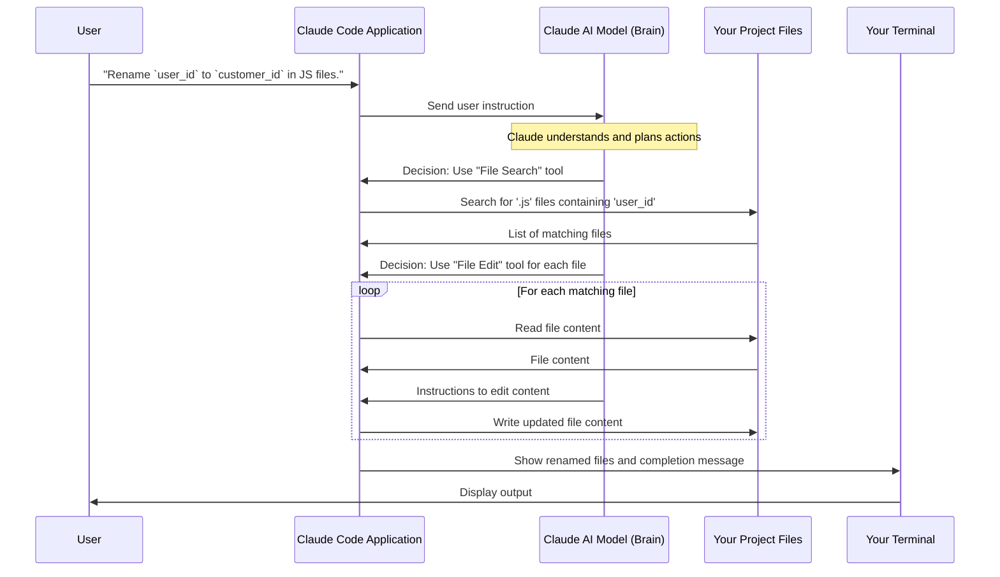

# Chapter 1: Claude Code Agent/Application

Imagine you're building a house, and you have a super smart, always-ready assistant by your side. You can just tell them, "Hey, can you grab those blueprints and tell me what the plumbing looks like on the second floor?" or "Can you automatically clean up all the sawdust from the floor?" That's pretty much what the Claude Code Agent is for developers!

### What Problem Does it Solve?

As a developer, you spend a lot of time on tasks that are repetitive or require understanding many parts of a project. Maybe you need to:

*   Rename a variable across many files.
*   Quickly understand what a piece of code does.
*   Automate a task like finding all files with a certain error message.
*   Even handle basic Git operations like committing changes.

These tasks can be tedious and take your focus away from the more exciting parts of coding. This is where the Claude Code Agent steps in!

### What is the Claude Code Agent/Application?

The **Claude Code Agent/Application** is your main intelligent assistant for coding. Think of it as:

*   **A Super Smart Coding Companion:** It's like having an expert programmer friend living right inside your computer's command line (your terminal).
*   **Understands Your Language:** Instead of typing complex commands, you can just tell it what you want in plain English (or other natural languages!). For example, "Change the variable `oldCounter` to `newCount`."
*   **Knows Your Codebase:** It understands the files and structure of your project, just like you do.
*   **Automates Tasks:** It can interact with your files, use tools like Git, and run other programs to get things done for you.

Essentially, it's the "brain" that takes your instructions and executes them to help you code faster and more efficiently.

### How Does it Work and How Do I Get Started?

Using Claude Code is straightforward. Let's look at a simple example: renaming a variable.

**1. Installation:**

First, you need to "install" your smart assistant. Claude Code is a modern web application, so you install it using `npm`, a package manager for Node.js (a popular tool for JavaScript development).

```bash
npm install -g @anthropic-ai/claude-code
```

This command tells your computer to download and set up the Claude Code application globally, making it available from any project directory. It's like adding a new app to your computer that you can launch from anywhere.

You can see this installation command in action, for example, within a `Dockerfile` if you're setting up a development container:

```dockerfile
# ... other setup steps ...

# Install Claude
RUN npm install -g @anthropic-ai/claude-code@${CLAUDE_CODE_VERSION}

# ... more setup steps ...
```

This snippet from the `Dockerfile` shows that `npm install -g @anthropic-ai/claude-code` is the standard way to get Claude Code onto your system, ready to run.

**2. Running the Agent:**

Once installed, navigate to your project directory in your terminal. This is important because Claude Code needs to know which project files it should be helping you with.

Then, simply type `claude`:

```bash
cd my-cool-project
claude
```

When you run `claude`, it launches the interactive assistant right in your terminal. You'll see a prompt where you can start typing your requests.

**3. Interacting with the Agent (A Simple Use Case):**

Let's say you have a variable named `user_id` that you want to rename to `customer_id` across your entire project.

You would launch Claude Code and then type:

```
claude
# Claude Code launches in your terminal...
> Rename the variable `user_id` to `customer_id` in all JavaScript files.
```

**What happens next?**

Claude Code will "think" for a moment, understanding your request. It will then use its tools (like searching for files, reading them, and making edits) to perform the renaming task. It might even ask you for confirmation before making changes.

It's similar to how you would manually search and replace, but Claude handles all the steps.

### Under the Hood: How it Works (Simplified)

When you type a command into Claude Code, a series of steps unfold:

1.  **You Speak (or Type):** You provide an instruction in natural language.
2.  **Claude Listens (and Understands):** The Claude Code application takes your instruction and sends it to the powerful AI model (the "brain").
3.  **Claude Thinks and Plans:** The AI model processes your request, understands your intent, and decides which tools it needs to use to achieve your goal. For our rename example, it might decide it needs a "file search" tool and a "file edit" tool.
4.  **Claude Acts (Uses Tools):** The application then uses these "tools" (which are pieces of code that can interact with your system, like running shell commands, reading/writing files, or using Git).
5.  **Claude Reports Back:** The results of these tool actions are shown back to you in the terminal.

Here's a simplified sequence of events for our rename example:



**Beyond Your Local Terminal:**

The Claude Code Agent isn't just limited to running directly in your terminal. It can also be integrated into other development workflows, such as GitHub Actions. This means Claude can help automate tasks even in your project's online repository!

For instance, a GitHub Workflow file might look something like this:

```yaml
# ... other workflow configuration ...

jobs:
  claude:
    # ... conditions for when Claude should run ...
    steps:
      - name: Checkout repository
        uses: actions/checkout@v4
        with:
          fetch-depth: 1

      - name: Run Claude Code
        id: claude
        uses: anthropics/claude-code-action@beta
        with:
          anthropic_api_key: ${{ secrets.ANTHROPIC_API_KEY }}
```

This snippet from `.github/workflows/claude.yml` shows that you can configure Claude Code to run automatically within GitHub when certain events happen (like a new issue being opened or a comment being made). This allows Claude to assist with code reviews, issue management, and other automated development tasks right where your code lives. We'll explore [GitHub Actions Workflows](03_github_actions_workflows_.md) in more detail later.

### Conclusion

In this chapter, you've learned that the Claude Code Agent is your intelligent coding companion, living in your terminal, understanding natural language, and automating development tasks. You saw how to install it using `npm` and how to start interacting with it for simple tasks like renaming variables. You also got a peek at how it uses an AI model and various tools to achieve your goals and how it can even be used within GitHub workflows.

Next, we'll dive deeper into specific commands you can use with Claude Code to supercharge your interactions.

[Next Chapter: Claude Code Slash Commands](02_claude_code_slash_commands_.md)

---

<sub><sup>Generated by [AI Codebase Knowledge Builder](https://github.com/The-Pocket/Tutorial-Codebase-Knowledge).</sup></sub> <sub><sup>**References**: [[1]](https://github.com/anthropics/claude-code/blob/f73eee0ead76eec52b7d2852ff643fa98a49f75f/.devcontainer/Dockerfile), [[2]](https://github.com/anthropics/claude-code/blob/f73eee0ead76eec52b7d2852ff643fa98a49f75f/.github/workflows/claude.yml), [[3]](https://github.com/anthropics/claude-code/blob/f73eee0ead76eec52b7d2852ff643fa98a49f75f/CHANGELOG.md), [[4]](https://github.com/anthropics/claude-code/blob/f73eee0ead76eec52b7d2852ff643fa98a49f75f/README.md)</sup></sub>