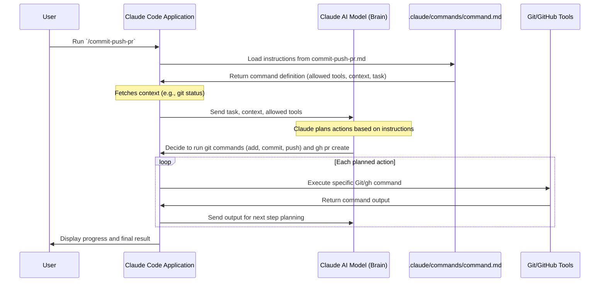

# Chapter 2: Claude Code Slash Commands

Welcome back, aspiring developer! In the last chapter, [Claude Code Agent/Application](01_claude_code_agent_application_.md), we met our super-smart coding assistant, the Claude Code Agent. We learned how it understands our natural language and automates basic tasks like renaming variables.

But what if you have a task that's *not* just one simple step? What if it involves many steps, always in the same order, and you do it all the time? That's where **Claude Code Slash Commands** come in handy!

### What Problem Do Slash Commands Solve?

Imagine you're building something and you have a sequence of actions you always perform together, like:
1.  Put on your hard hat.
2.  Grab your hammer.
3.  Nail down a board.
4.  Put the hammer back.

Doing these four steps individually every time you want to nail something can feel slow. What if you could just say "Nail the board!" and your assistant automatically does all four steps for you?

In coding, we have similar multi-step tasks. A common one is:

1.  **Stage your changes** (tell Git which files you want to include in your next save).
2.  **Commit your changes** (save them with a message).
3.  **Push your changes** to your online repository (like GitHub).
4.  **Create a Pull Request (PR)** so others can review your work.

Performing these four steps, sometimes involving multiple Git commands and a trip to your browser, can be tedious. This is exactly the kind of problem Claude Code Slash Commands are designed to solve! They let you bundle these common sequences into a single, easy-to-use "recipe."

### What are Claude Code Slash Commands?

**Claude Code Slash Commands** are like "pre-programmed recipes" or "custom shortcuts" you create within your project for your Claude Code Agent. They are:

*   **User-defined:** You decide what tasks they perform.
*   **Multi-step automation:** They combine many individual actions into one.
*   **Easy to invoke:** You just type `/` followed by the command name.
*   **Project-specific:** They live within your project and are tailored to its needs.

Think of them as extending Claude Code's brain to perfectly fit your project's unique workflows.

### How to Use a Slash Command (Our Example: Commit, Push, PR)

Let's use our common scenario: committing your changes, pushing them, and creating a Pull Request.

**1. Create the Command File:**

Claude Code Slash Commands are defined in special Markdown files (`.md`) inside a `.claude/commands/` folder in your project. Each file defines one command.

For our `commit-push-pr` command, you would create a file like this:

```
your-project/
├── .claude/
│   └── commands/
│       └── commit-push-pr.md  <-- This is our command file!
├── src/
└── ...
```

**2. Define the Command's Instructions:**

Inside `commit-push-pr.md`, you write instructions in plain English, just like you would tell a human assistant. You also tell Claude what tools it's allowed to use.

**3. Running the Command:**

Once the command file is in place, using it is super simple. First, make sure you've made some changes to your code. Then, launch Claude Code in your terminal, and use the `/` prefix followed by the command's filename (without the `.md` extension):

```bash
cd my-cool-project # Make sure you are in your project directory
claude
# Claude Code launches in your terminal...
> /commit-push-pr
```

**What happens next?**

When you type `/commit-push-pr`, Claude Code will load the instructions from the `commit-push-pr.md` file. It will then follow those instructions:

*   It will check your current Git status.
*   It might ask you for a commit message.
*   It will create a new branch if you're on `main`.
*   It will stage and commit your changes.
*   It will push your new branch to GitHub.
*   Finally, it will open a Pull Request for you!

All of this happens with just one simple `/commit-push-pr` command!

### Under the Hood: How Slash Commands Work

Let's peek behind the curtain to understand how Claude Code turns `/commit-push-pr` into a series of automated actions.

**1. The Command File Structure:**

Each slash command is a Markdown file in the `.claude/commands/` directory. It has three main parts:

*   **YAML Front Matter:** This is a block at the very top, enclosed by `---` lines. It contains important settings for the command.
*   **Context Section:** Here, you can tell Claude to fetch live information from your project using special `!` syntax (e.g., `!git status`).
*   **Task Section:** This is where you write the step-by-step instructions for Claude in natural language.

Let's look at parts of the `commit-push-pr.md` file:

```markdown
---
allowed-tools: Bash(git checkout --branch:*), Bash(git add:*), Bash(git commit:*), Bash(git push:*), Bash(gh pr create:*)
description: Commit, push, and open a PR
---

## Context

- Current git status: !`git status`
- Current branch: !`git branch --show-current`

## Your task

Based on the above changes:
1. Create a new branch if on main
2. Create a single commit with an appropriate message
3. Push the branch to origin
# ... (more instructions continue here)
```

*   **`allowed-tools`**: This is a crucial security feature. It tells Claude *exactly* which tools (like specific Git commands or `gh` for GitHub) it is allowed to use for this command. Claude *cannot* use any tool not listed here, preventing unexpected actions.
*   **`description`**: A short, helpful explanation of what the command does.
*   **`!git status`**: The `!` before a command tells Claude to run that command in your terminal *before* starting the task and use its output as `Context`. This helps Claude understand the current state of your project.
*   **`Your task`**: These are the step-by-step instructions Claude's AI brain will follow. It uses its intelligence and the allowed tools to execute these steps.

**2. The Execution Flow:**

When you run a slash command, here's a simplified sequence of events:



Essentially, the Claude Code Application loads your "recipe" from the Markdown file. It then sends these instructions, along with any current project context (like `git status`), to the smart [Claude Code Agent/Application](01_claude_code_agent_application_.md) (the AI model). The AI understands the steps and uses the specifically "allowed tools" to carry them out, reporting back to you all the way.

**Another Example: Finding Duplicate Issues**

Here's another glimpse at a slash command, `dedupe.md`, which helps with issue management on GitHub. This is just a quick peek to show how versatile slash commands can be. We'll learn more about [GitHub Automation Scripts (Issue Management)](04_github_automation_scripts__issue_management__.md) later.

```markdown
---
allowed-tools: Bash(gh issue view:*), Bash(gh search:*), Bash(gh issue comment:*)
description: Find duplicate GitHub issues
---

Find up to 3 likely duplicate issues for a given GitHub issue.

To do this, follow these steps precisely:

1. Use an agent to check if the Github issue is closed...
# ... (more steps for finding and commenting on duplicates)
```

Notice how this command also lists specific `gh` tools it's allowed to use and then gives Claude detailed instructions on how to find and comment on duplicate issues.

### Conclusion

You've now learned about Claude Code Slash Commands, your personal shortcuts for automating multi-step tasks. You saw how they act as "pre-programmed recipes" defined in Markdown files, specifying allowed tools and natural language instructions. By using `/` followed by the command name, you can trigger complex workflows like committing, pushing, and creating a Pull Request with a single input, making your development process much more efficient and consistent.

Next, we'll see how these powerful capabilities of Claude Code can be integrated with [GitHub Actions Workflows](03_github_actions_workflows_.md) to automate tasks right within your project's online repository!

[Next Chapter: GitHub Actions Workflows](03_github_actions_workflows_.md)

---

<sub><sup>Generated by [AI Codebase Knowledge Builder](https://github.com/The-Pocket/Tutorial-Codebase-Knowledge).</sup></sub> <sub><sup>**References**: [[1]](https://github.com/anthropics/claude-code/blob/f73eee0ead76eec52b7d2852ff643fa98a49f75f/.claude/commands/commit-push-pr.md), [[2]](https://github.com/anthropics/claude-code/blob/f73eee0ead76eec52b7d2852ff643fa98a49f75f/.claude/commands/dedupe.md)</sup></sub>