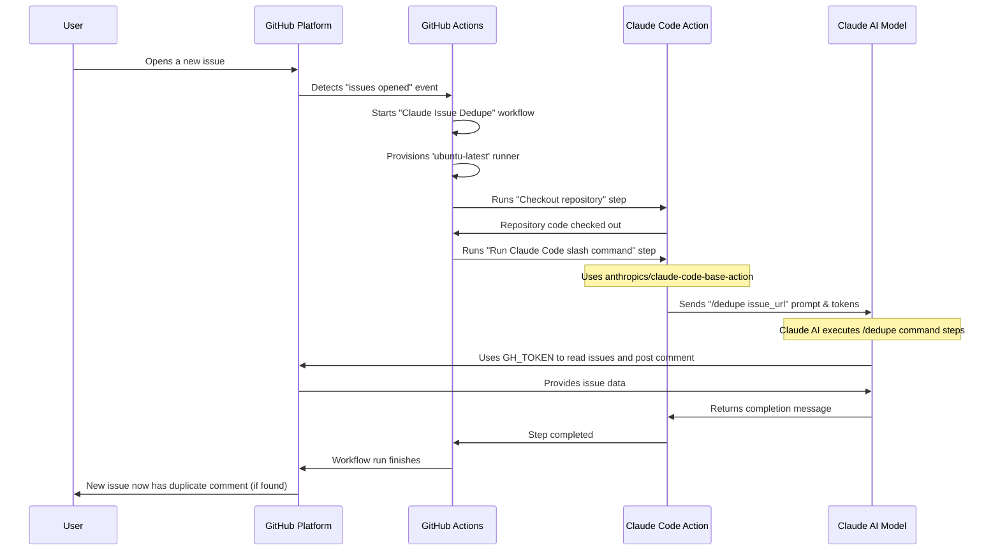

# Chapter 3: GitHub Actions Workflows

Welcome back! In our last chapter, [Claude Code Slash Commands](02_claude_code_slash_commands_.md), we learned how to create powerful "recipes" for our Claude Code Agent to automate multi-step tasks right in our terminal. Imagine you created a fantastic slash command, `/dedupe`, that automatically finds and flags duplicate issues on GitHub. That's great for when you run Claude Code manually!

But what if you want this to happen **automatically, every single time a new issue is opened, without you lifting a finger?** What if you want your super-smart assistant working for you 24/7 in the cloud? This is where **GitHub Actions Workflows** come into play!

### The Problem: Manual Repetitive Tasks on GitHub

Think about tasks you often do on GitHub:
*   Adding labels to new issues.
*   Commenting on pull requests.
*   Running tests when new code is pushed.
*   Closing stale issues.
*   And, as we just discussed, checking for duplicate issues.

Doing these things manually, for every single event, can be incredibly time-consuming and prone to human error. You want your project to be efficient and consistent, but constantly monitoring and reacting to every GitHub event is impossible.

### What are GitHub Actions Workflows?

**GitHub Actions Workflows** are like the "orchestra conductor" for your GitHub repository's automation. They are:

*   **Automated programs:** They define a series of tasks to run.
*   **Event-driven:** They wake up and perform tasks when specific things happen (e.g., someone opens an issue, pushes code, or even on a schedule).
*   **Cloud-based:** They run on GitHub's servers, not on your computer. This means they're always ready, even when your computer is off.
*   **Defined in YAML:** You write them in simple text files using a format called YAML, stored in your repository.

Essentially, a workflow is a set of instructions that tells GitHub: "When *this* happens, do *these* steps." And here's the exciting part: one of those steps can be running your [Claude Code Agent/Application](01_claude_code_agent_application_.md) to perform intelligent tasks!

### Core Concepts of a GitHub Actions Workflow

Let's break down the main ingredients of a workflow:

1.  **`name`**: A human-readable title for your workflow.
2.  **`on` (Event Trigger)**: This defines *when* the workflow should run. It could be:
    *   `issues: types: [opened]` (when an issue is opened)
    *   `push` (when code is pushed)
    *   `pull_request` (when a pull request is created)
    *   `schedule` (at specific times, like every day at 9 AM)
    *   `workflow_dispatch` (to run manually with custom inputs)
3.  **`jobs`**: A workflow can have one or more jobs. Jobs run in parallel by default, but you can set them to run sequentially. Each job usually has:
    *   `runs-on`: The type of machine (operating system) the job will run on, like `ubuntu-latest` (a common Linux server).
    *   `permissions`: What this job is allowed to do (e.g., `issues: write` means it can create/update issues).
    *   `steps`: The actual actions the job performs.
4.  **`steps`**: These are individual tasks within a job. A step can be:
    *   Running a command line script (e.g., `run: echo "Hello"`).
    *   Using a pre-built **Action** (e.g., `uses: actions/checkout@v4` to get your code).

### Our Use Case: Auto-Deduplicating GitHub Issues with Claude Code

Let's look at a real-world example from the `claude-code` project: automatically detecting duplicate issues using Claude Code. This workflow runs the `/dedupe` slash command we briefly saw in the previous chapter.

Imagine a new issue is opened. We want our Claude Code Agent to instantly analyze it, compare it to existing issues, and if it finds duplicates, comment on the new issue with links to the older ones.

Here's a simplified version of a GitHub Actions workflow file (`.github/workflows/claude-dedupe-issues.yml`) that does exactly this:

```yaml
# .github/workflows/claude-dedupe-issues.yml
name: Claude Issue Dedupe
description: Automatically dedupe GitHub issues using Claude Code
on:
  issues:
    types: [opened] # Trigger when a new issue is opened
  workflow_dispatch: # Allows manual triggering
    inputs:
      issue_number: # An input for manual runs
        description: 'Issue number to process for duplicate detection'
        required: true
        type: string

jobs:
  claude-dedupe-issues: # Name of our job
    runs-on: ubuntu-latest # Run on a Linux server
    timeout-minutes: 10 # Stop if it takes too long
    permissions:
      contents: read # Allow reading repository content
      issues: write # Allow writing comments/labels to issues

    steps:
      - name: Checkout repository
        uses: actions/checkout@v4 # Get the code from our repo

      - name: Run Claude Code slash command
        uses: anthropics/claude-code-base-action@beta # Use the special Claude Code Action
        with:
          prompt: "/dedupe ${{ github.repository }}/issues/${{ github.event.issue.number || inputs.issue_number }}" # The command for Claude
          anthropic_api_key: ${{ secrets.ANTHROPIC_API_KEY }} # Our Claude API key (kept secret)
          claude_env: |
            GH_TOKEN: ${{ secrets.GITHUB_TOKEN }} # GitHub token for Claude to use
```

Let's break this down step-by-step:

**1. Workflow Name and Description:**
```yaml
name: Claude Issue Dedupe
description: Automatically dedupe GitHub issues using Claude Code
```
This just gives our workflow a clear title and a short explanation so we know what it does at a glance.

**2. The Trigger (`on`):**
```yaml
on:
  issues:
    types: [opened] # Trigger when a new issue is opened
  workflow_dispatch: # Allows manual triggering
    inputs:
      issue_number:
        description: 'Issue number to process for duplicate detection'
        required: true
        type: string
```
*   `issues: types: [opened]`: This is the magic! It tells GitHub: "Hey, whenever someone opens a *new issue* in this repository, start this workflow!"
*   `workflow_dispatch`: This is a handy option that lets you manually run the workflow from the "Actions" tab on GitHub. It includes an `issue_number` input so you can tell it which issue to process when running manually.

**3. The Job (`jobs`):**
```yaml
jobs:
  claude-dedupe-issues: # Name of our job
    runs-on: ubuntu-latest # Run on a Linux server
    timeout-minutes: 10 # Stop if it takes too long
    permissions:
      contents: read # Allow reading repository content
      issues: write # Allow writing comments/labels to issues
```
*   `claude-dedupe-issues`: This is the unique identifier for our job.
*   `runs-on: ubuntu-latest`: This tells GitHub to spin up a fresh virtual machine (a temporary computer) running the latest Ubuntu Linux to execute our tasks.
*   `permissions`: This is crucial for security! We explicitly tell GitHub that this job is allowed to `read` our repository's contents and `write` to issues (so Claude can post comments).

**4. The Steps (`steps`):**

Inside our job, we define the individual steps:

```yaml
      - name: Checkout repository
        uses: actions/checkout@v4 # Get the code from our repo
```
*   `name: Checkout repository`: A friendly name for this step.
*   `uses: actions/checkout@v4`: This is a pre-built GitHub Action. It's like a small program that GitHub provides to quickly download your repository's code onto the `ubuntu-latest` machine so that subsequent steps can access your project files (including your `.claude/commands` folder!).

```yaml
      - name: Run Claude Code slash command
        uses: anthropics/claude-code-base-action@beta # Use the special Claude Code Action
        with:
          prompt: "/dedupe ${{ github.repository }}/issues/${{ github.event.issue.number || inputs.issue_number }}" # The command for Claude
          anthropic_api_key: ${{ secrets.ANTHROPIC_API_KEY }} # Our Claude API key (kept secret)
          claude_env: |
            GH_TOKEN: ${{ secrets.GITHUB_TOKEN }} # GitHub token for Claude to use
```
*   `name: Run Claude Code slash command`: Another descriptive name.
*   `uses: anthropics/claude-code-base-action@beta`: This is the special GitHub Action provided by Anthropic (the creators of Claude) that knows how to run Claude Code!
*   `with:`: These are the inputs we provide to the `claude-code-base-action`:
    *   `prompt: "/dedupe ..."`: This is where we tell Claude Code what to do. Notice `/dedupe` – this calls our slash command! The rest of the string (`${{ github.repository }}/issues/${{ github.event.issue.number || inputs.issue_number }}`) simply passes the full URL of the newly opened issue to our `/dedupe` command, which Claude then uses to find duplicates.
    *   `anthropic_api_key: ${{ secrets.ANTHROPIC_API_KEY }}`: This securely passes your secret API key for Claude. `secrets.` means it's stored safely in your GitHub repository settings, not directly in your workflow file.
    *   `claude_env: | GH_TOKEN: ${{ secrets.GITHUB_TOKEN }}`: This provides a special GitHub Token to Claude. Our `/dedupe` command needs this token to interact with GitHub (like reading issue details and posting comments), and this ensures Claude has the necessary permissions.

### Under the Hood: How a Workflow Works

Let's visualize the flow when an issue is opened:



1.  **Event Occurs:** You or another contributor opens a new issue on GitHub.
2.  **GitHub Notices:** The GitHub platform detects this `issues: types: [opened]` event.
3.  **Workflow Triggered:** GitHub Actions sees this event matches our `claude-dedupe-issues` workflow and starts it.
4.  **Runner Prepared:** GitHub Actions sets up a temporary virtual machine (`ubuntu-latest`) to run our job.
5.  **Repository Checkout:** The first step runs (`actions/checkout@v4`), downloading our project's code onto the virtual machine. This is important so Claude Code can access our `.claude/commands/dedupe.md` file!
6.  **Claude Code Runs:** The second step runs, using the `anthropics/claude-code-base-action`. This action takes our `/dedupe` prompt and necessary API keys.
7.  **Claude AI Executes:** The Claude AI model receives the `/dedupe` command and the issue details. It then follows the instructions defined in your `dedupe.md` slash command, using the provided `GH_TOKEN` to interact with GitHub (read existing issues, identify duplicates, and then post a comment on the new issue).
8.  **Workflow Finishes:** Claude reports back, the job completes, and the virtual machine is shut down. The new issue now has a helpful comment identifying duplicates, all automatically!

### Other Workflow Examples

GitHub Actions can be used for many kinds of automation. Here are a few more types of workflows you might see in a project:

*   **Scheduled Tasks (`auto-close-duplicates.yml`):**
    ```yaml
    # .github/workflows/auto-close-duplicates.yml
    name: Auto-close duplicate issues
    on:
      schedule:
        - cron: "0 9 * * *" # Runs every day at 9 AM UTC
    jobs:
      auto-close-duplicates:
        runs-on: ubuntu-latest
        steps:
          - name: Auto-close duplicate issues
            run: bun run scripts/auto-close-duplicates.ts # Runs a custom script
            # ...
    ```
    This workflow runs on a `schedule` (like a recurring alarm clock) to periodically check for and automatically close issues that have been marked as duplicates by a script.

*   **Issue Triage with Claude (`claude-issue-triage.yml`):**
    ```yaml
    # .github/workflows/claude-issue-triage.yml
    name: Claude Issue Triage
    description: Automatically triage GitHub issues using Claude Code
    on:
      issues:
        types: [opened] # Trigger when a new issue is opened
    jobs:
      triage-issue:
        runs-on: ubuntu-latest
        steps:
          # ... setup steps ...
          - name: Run Claude Code for Issue Triage
            uses: anthropics/claude-code-base-action@beta
            with:
              prompt_file: /tmp/claude-prompts/triage-prompt.txt # Claude gets a detailed prompt from a file
              allowed_tools: "Bash(gh label list),mcp__github__get_issue,..." # Specifies tools Claude can use
              # ...
    ```
    Similar to the dedupe workflow, this one triggers when an `issue` is `opened`. Instead of a slash command, it uses a longer `prompt_file` to instruct Claude to analyze the issue and apply appropriate labels (triage).

### Conclusion

You've now unlocked the power of GitHub Actions Workflows! You understand that they are automated "recipes" that run on GitHub's servers in response to specific events. You learned about the core components like `on` (triggers), `jobs`, and `steps`, and saw how to use a special GitHub Action to integrate your [Claude Code Agent/Application](01_claude_code_agent_application_.md) to automate intelligent tasks, such as finding duplicate issues, without manual intervention. This allows for consistent and efficient management of your project right where your code lives.

Next, we'll dive deeper into specific [GitHub Automation Scripts (Issue Management)](04_github_automation_scripts__issue_management__.md) that these workflows can run to make your issue tracking even smarter.

[Next Chapter: GitHub Automation Scripts (Issue Management)](04_github_automation_scripts__issue_management__.md)

---

<sub><sup>Generated by [AI Codebase Knowledge Builder](https://github.com/The-Pocket/Tutorial-Codebase-Knowledge).</sup></sub> <sub><sup>**References**: [[1]](https://github.com/anthropics/claude-code/blob/f73eee0ead76eec52b7d2852ff643fa98a49f75f/.github/workflows/auto-close-duplicates.yml), [[2]](https://github.com/anthropics/claude-code/blob/f73eee0ead76eec52b7d2852ff643fa98a49f75f/.github/workflows/backfill-duplicate-comments.yml), [[3]](https://github.com/anthropics/claude-code/blob/f73eee0ead76eec52b7d2852ff643fa98a49f75f/.github/workflows/claude-dedupe-issues.yml), [[4]](https://github.com/anthropics/claude-code/blob/f73eee0ead76eec52b7d2852ff643fa98a49f75f/.github/workflows/claude-issue-triage.yml), [[5]](https://github.com/anthropics/claude-code/blob/f73eee0ead76eec52b7d2852ff643fa98a49f75f/.github/workflows/claude.yml), [[6]](https://github.com/anthropics/claude-code/blob/f73eee0ead76eec52b7d2852ff643fa98a49f75f/.github/workflows/issue-opened-dispatch.yml), [[7]](https://github.com/anthropics/claude-code/blob/f73eee0ead76eec52b7d2852ff643fa98a49f75f/.github/workflows/lock-closed-issues.yml), [[8]](https://github.com/anthropics/claude-code/blob/f73eee0ead76eec52b7d2852ff643fa98a49f75f/.github/workflows/log-issue-events.yml)</sup></sub>