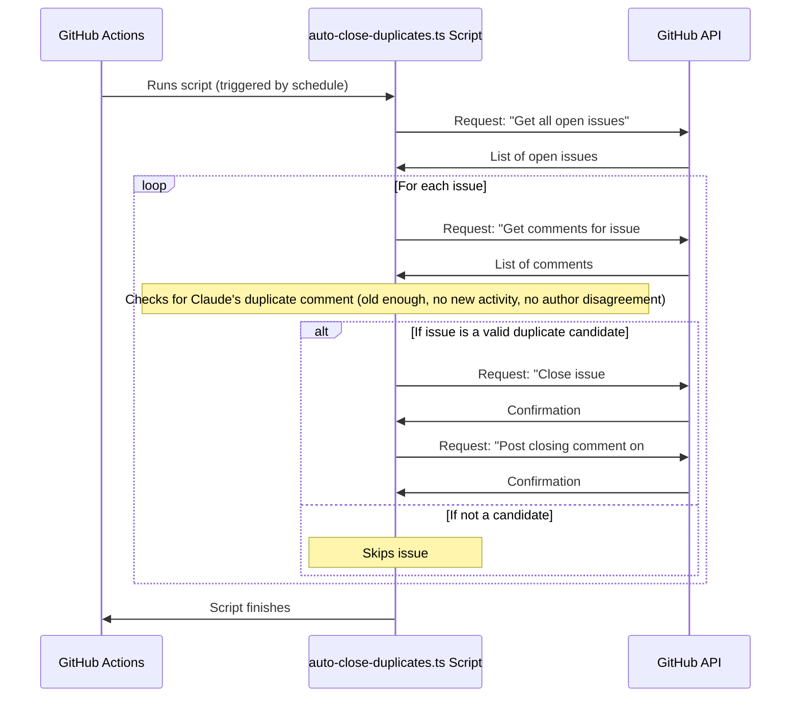

# Chapter 4: GitHub Automation Scripts (Issue Management)

Welcome back, future automation master! In our previous chapter, [GitHub Actions Workflows](03_github_actions_workflows_.md), we learned how to set up GitHub to automatically run tasks when specific events happen – like running our Claude Code `/dedupe` command when a new issue is opened. That's powerful! Claude can *find* duplicate issues and comment on them.

But what if you want to take it a step further? What if you want to automatically *close* those identified duplicate issues after a few days, or perform other complex issue management tasks that go beyond what a simple slash command can do directly?

This is where **GitHub Automation Scripts (Issue Management)** come into play.

### The Problem: Beyond Simple Automation on GitHub

While [Claude Code Slash Commands](02_claude_code_slash_commands_.md) are great for focused, single-interaction tasks (like finding duplicates and commenting), and [GitHub Actions Workflows](03_github_actions_workflows_.md) are excellent for triggering these tasks, sometimes you need a more robust, custom program to handle complex logic.

Imagine you want to:
*   **Automatically close issues** that have been flagged as duplicates by Claude Code, but only after a certain waiting period and if there's no objection from the author.
*   **Backfill duplicate comments:** Go through *old* issues and run the Claude deduplication process on them, even if they were opened before your automation was set up.
*   **Periodically clean up** stale issues or pull requests.

These tasks involve more complex decision-making, reading historical data, and often performing multiple GitHub API calls over time. This is too much for a simple, single-run Claude slash command.

### What are GitHub Automation Scripts?

**GitHub Automation Scripts** are dedicated programs (written in languages like TypeScript or JavaScript) that are designed to interact directly with the GitHub API. They act like your diligent administrative assistant, capable of understanding complex rules and performing a series of actions on GitHub issues.

Think of them as:
*   **Custom Helpers:** They are tailored to your project's specific needs for managing issues.
*   **Deep Integrators:** They can read almost any detail about an issue, comment, or reaction, and then apply changes like closing issues, adding labels, or posting new comments.
*   **Often Triggered by Workflows:** While they can be run manually, they often get their marching orders from a [GitHub Actions Workflow](03_github_actions_workflows_.md), which tells them *when* to run.
*   **The "Worker Bee" for Complex Tasks:** When Claude Code's intelligence identifies something, these scripts can then perform the detailed, rule-based actions.

These scripts ensure consistency and efficiency in managing your project's community feedback and keeping your issue tracker tidy.

### Our Use Case: Auto-Closing Duplicate Issues

Let's focus on the scenario of automatically closing duplicate issues.

In [Chapter 3: GitHub Actions Workflows](03_github_actions_workflows_.md), we saw how Claude Code can *identify* possible duplicates and post a comment like: "Found a possible duplicate: #123".

Now, we want a script that:
1.  **Finds open issues** that have such a "duplicate" comment from Claude.
2.  **Checks if the comment is old enough** (e.g., 3 days) to give people time to react.
3.  **Ensures there's no new activity** (like a new comment) after Claude's duplicate suggestion.
4.  **Checks for negative reactions** (like a thumbs down) from the issue author, indicating disagreement.
5.  **If all conditions are met,** automatically closes the issue and posts a final comment.

This is exactly what the `scripts/auto-close-duplicates.ts` script in the `claude-code` project does!

### How These Scripts Work (High-Level)

These scripts typically perform the following steps:

1.  **Get a GitHub Token:** They need a special "key" (a `GITHUB_TOKEN`) to prove they are allowed to talk to GitHub. This is usually provided securely by [GitHub Actions Workflows](03_github_actions_workflows_.md) as an environment variable.
2.  **Make GitHub API Requests:** They use this token to send commands to GitHub (e.g., "Give me all open issues," "Show me comments for issue #X," "Close issue #Y").
3.  **Process Data:** They analyze the information received from GitHub (e.g., check comment text, dates, reactions).
4.  **Perform Actions:** Based on their logic, they send new commands back to GitHub (e.g., "Add label 'duplicate' to issue #Z," "Close issue #Z," "Post a comment on issue #Z").

Let's look at the `auto-close-duplicates.ts` script as an example. It's often run by a [GitHub Actions Workflow](03_github_actions_workflows_.md) on a schedule, like once a day.

```yaml
# .github/workflows/auto-close-duplicates.yml
name: Auto-close duplicate issues
on:
  schedule:
    - cron: "0 9 * * *" # Runs every day at 9 AM UTC
jobs:
  auto-close-duplicates:
    runs-on: ubuntu-latest
    permissions:
      issues: write # Important: allows the script to close issues and comment
    steps:
      - uses: actions/checkout@v4
      - uses: oven-sh/setup-bun@v1 # Setup Bun, a fast JavaScript runtime
      - name: Run Auto-close script
        run: bun run scripts/auto-close-duplicates.ts # Execute our script!
        env: # Pass environment variables to the script
          GITHUB_TOKEN: ${{ secrets.GITHUB_TOKEN }}
          GITHUB_REPOSITORY_OWNER: ${{ github.repository_owner }}
          GITHUB_REPOSITORY_NAME: ${{ github.event.repository.name }}
```
This [GitHub Actions Workflow](03_github_actions_workflows_.md) runs our script daily. It ensures the script has the `GITHUB_TOKEN` and permissions to modify issues.

### Under the Hood: A Look at `auto-close-duplicates.ts`

Let's trace what happens when `auto-close-duplicates.ts` runs.



Let's break down some key parts of the `scripts/auto-close-duplicates.ts` file.

**1. Talking to GitHub (`githubRequest`):**
Every interaction with GitHub happens through its API. The `githubRequest` function handles sending these messages.

```typescript
// From scripts/auto-close-duplicates.ts
async function githubRequest<T>(endpoint: string, token: string, method: string = 'GET', body?: any): Promise<T> {
  const response = await fetch(`https://api.github.com${endpoint}`, {
    method,
    headers: {
      Authorization: `Bearer ${token}`, // The secret token!
      Accept: "application/vnd.github.v3+json",
      "User-Agent": "auto-close-duplicates-script",
      // ... other headers
    },
    ...(body && { body: JSON.stringify(body) }), // For sending data (like closing an issue)
  });

  // ... error handling
  return response.json(); // Return the data from GitHub
}
```
*   This function is like the script's "phone" to call GitHub.
*   It takes an `endpoint` (what part of GitHub we want to talk to, like `/repos/owner/repo/issues`), the `token` (our access key), the `method` (like `GET` for reading, `PATCH` or `POST` for changing things), and optional `body` (the data we want to send).

**2. Finding the Duplicate Issue Number (`extractDuplicateIssueNumber`):**
Claude Code's comments include the number of the original issue. This function extracts that number.

```typescript
// From scripts/auto-close-duplicates.ts
function extractDuplicateIssueNumber(commentBody: string): number | null {
  // Try to match #123 format first
  let match = commentBody.match(/#(\d+)/);
  if (match) {
    return parseInt(match[1], 10);
  }
  
  // Try to match GitHub issue URL format: https://github.com/owner/repo/issues/123
  match = commentBody.match(/github\.com\/[^\/]+\/[^\/]+\/issues\/(\d+)/);
  if (match) {
    return parseInt(match[1], 10);
  }
  
  return null;
}
```
*   This function uses regular expressions (`.match(/#(\d+)/)`) to search for patterns like `#123` or a full GitHub issue URL within the comment's text.
*   It then extracts the number and converts it to a proper number (`parseInt`).

**3. Closing the Issue (`closeIssueAsDuplicate`):**
Once all checks pass, this function performs the actual closing and comments.

```typescript
// From scripts/auto-close-duplicates.ts
async function closeIssueAsDuplicate(
  owner: string,
  repo: string,
  issueNumber: number,
  duplicateOfNumber: number,
  token: string
): Promise<void> {
  // First, close the issue and add a 'duplicate' label
  await githubRequest(
    `/repos/${owner}/${repo}/issues/${issueNumber}`,
    token,
    'PATCH', // PATCH is used to update parts of an existing resource
    {
      state: 'closed',        // Set the state to closed
      state_reason: 'duplicate', // Explain *why* it's closed
      labels: ['duplicate']   // Add a 'duplicate' label
    }
  );

  // Second, add a comment explaining the closure
  await githubRequest(
    `/repos/${owner}/${repo}/issues/${issueNumber}/comments`,
    token,
    'POST', // POST is used to create a new resource (like a new comment)
    {
      body: `This issue has been automatically closed as a duplicate of #${duplicateOfNumber}.

If this is incorrect, please re-open this issue or create a new one.

🤖 Generated with [Claude Code](https://claude.ai/code)`
    }
  );
}
```
*   This function uses `githubRequest` twice:
    *   One `PATCH` request to update the issue's `state` to `closed` and `state_reason` to `duplicate`, and to add a `duplicate` label.
    *   Another `POST` request to add a new comment explaining the automatic closure and linking to the original duplicate.

### Another Example: Backfilling Duplicate Comments

Another script, `scripts/backfill-duplicate-comments.ts`, shows how these automation scripts can also *trigger* [GitHub Actions Workflows](03_github_actions_workflows_.md) themselves!

Its job is to go through a range of older issues and, for any that don't already have a Claude duplicate comment, trigger the `claude-dedupe-issues.yml` workflow (which we saw in [Chapter 3: GitHub Actions Workflows](03_github_actions_workflows_.md)).

```typescript
// From scripts/backfill-duplicate-comments.ts
async function triggerDedupeWorkflow(
  owner: string,
  repo: string,
  issueNumber: number,
  token: string,
  dryRun: boolean = true
): Promise<void> {
  if (dryRun) {
    console.log(`[DRY RUN] Would trigger dedupe workflow for issue #${issueNumber}`);
    return;
  }

  // This is the key: dispatching a workflow event!
  await githubRequest(
    `/repos/${owner}/${repo}/actions/workflows/claude-dedupe-issues.yml/dispatches`,
    token,
    'POST',
    {
      ref: 'main', // The branch the workflow should run on
      inputs: {
        issue_number: issueNumber.toString() // Pass the issue number as an input
      }
    }
  );
}
```
*   This function uses `githubRequest` to send a `POST` request to a special GitHub API endpoint (`/actions/workflows/.../dispatches`).
*   This `dispatches` endpoint is how you can programmatically tell GitHub to start a workflow (specifically, a workflow that has `workflow_dispatch` in its `on:` trigger, like our `claude-dedupe-issues.yml`).
*   It passes the `issue_number` as an `input`, just like if you manually typed it in the GitHub Actions UI.

This demonstrates how a dedicated script can orchestrate more complex automation, even involving triggering other automation components like [GitHub Actions Workflows](03_github_actions_workflows_.md) which then might run a [Claude Code Agent/Application](01_claude_code_agent_application_.md).

### Conclusion

In this chapter, you've learned about GitHub Automation Scripts (Issue Management), which are custom programs that handle complex, rule-based tasks on your GitHub issues. You saw how they act as diligent administrative assistants, interacting directly with the GitHub API to read issue data, apply complex logic, and make changes like closing issues or triggering other workflows. These scripts, often orchestrated by [GitHub Actions Workflows](03_github_actions_workflows_.md), are essential for maintaining a clean and efficient issue tracker, allowing your [Claude Code Agent/Application](01_claude_code_agent_application_.md) to focus on its intelligent tasks.

Next, we'll shift our focus to [Issue Templates](05_issue_templates_.md), which help users provide consistent and useful information when they open new issues, making your automation scripts and Claude Code even more effective!

[Next Chapter: Issue Templates](05_issue_templates_.md)

---

<sub><sup>Generated by [AI Codebase Knowledge Builder](https://github.com/The-Pocket/Tutorial-Codebase-Knowledge).</sup></sub> <sub><sup>**References**: [[1]](https://github.com/anthropics/claude-code/blob/f73eee0ead76eec52b7d2852ff643fa98a49f75f/scripts/auto-close-duplicates.ts), [[2]](https://github.com/anthropics/claude-code/blob/f73eee0ead76eec52b7d2852ff643fa98a49f75f/scripts/backfill-duplicate-comments.ts)</sup></sub>