```mermaid
sequenceDiagram
    participant User
    participant GitHubUI as GitHub Web Interface
    participant IssueTemplateFiles as .github/ISSUE_TEMPLATE/
    participant NewIssue as New GitHub Issue

    User->>GitHubUI: Clicks "New Issue" button
    GitHubUI->>IssueTemplateFiles: Reads available templates (e.g. bug_report.yml)
    IssueTemplateFiles->>GitHubUI: Returns list of templates and config
    GitHubUI->>User: Shows "Choose a template" page (or contact links if blank issues disabled)
    User->>GitHubUI: Selects "🐛 Bug Report" template
    GitHubUI->>IssueTemplateFiles: Loads bug_report.yml content
    IssueTemplateFiles->>GitHubUI: Returns form definition
    GitHubUI->>User: Displays the structured "Bug Report" form
    User->>GitHubUI: Fills out form fields and clicks "Submit new issue"
    GitHubUI->>NewIssue: Creates a new GitHub Issue
    NewIssue->>NewIssue: Issue title is "[BUG] My problem"
    NewIssue->>NewIssue: 'bug' label is added
    NewIssue->>NewIssue: Issue body contains all filled-in fields
    NewIssue->>GitHubUI: Issue now visible on GitHub
```

# Chapter 5: Issue Templates

Welcome back, fellow developer! In our previous chapter, [GitHub Automation Scripts (Issue Management)](04_github_automation_scripts__issue_management__.md), we learned how powerful custom scripts can be for cleaning up issues, like automatically closing duplicates. Imagine you have a super-efficient system running in the background, but what if the information it receives is messy or incomplete?

Think of it this way: your smart [Claude Code Agent/Application](01_claude_code_agent_application_.md) and your automation scripts are like expert chefs. They can cook amazing dishes, but they need good ingredients. If someone just throws a bag of "random stuff" at them and says "make dinner!", it's hard to get a good result. They need clear, organized ingredients.

### The Problem: Messy and Inconsistent Issue Reports

When people find a bug, request a feature, or want to document something in a project, they often open an "issue" on GitHub. Without guidance, these issues can look like this:

*   "Bug: it's broken!"
*   "Feature request: make it better."
*   "Docs: update something."

These issues are a nightmare for project maintainers (and for our smart automation!). They lack crucial details:
*   What exactly is broken?
*   How can we make it happen again (reproduce)?
*   What did you *expect* to happen?
*   What version are you using?
*   What operating system?

This leads to endless back-and-forth questions, slowing down bug fixes and new features. It also makes it very difficult for automation like [Claude Code Slash Commands](02_claude_code_slash_commands_.md) or [GitHub Automation Scripts (Issue Management)](04_github_automation_scripts__issue_management__.md) to process the information intelligently.

### What are Issue Templates?

**Issue templates** are like pre-designed forms or questionnaires that you provide on your GitHub repository. When someone wants to open a new issue, instead of seeing a blank text box, they see a choice of these forms (e.g., "Bug Report," "Feature Request," "Documentation Issue").

Think of them as:
*   **Standardized Questionnaires:** They ask specific questions to gather all the necessary information upfront.
*   **Guides for Users:** They tell people *what* information to provide, making it easier for them to report issues effectively.
*   **Clarity for Everyone:** They ensure maintainers (and automation!) get consistent, actionable data, reducing guesswork and speeding up resolutions.

By using issue templates, you get better quality information right from the start, which makes your project easier to manage and helps your intelligent assistants ([Claude Code Agent/Application](01_claude_code_agent_application_.md)) understand and act on issues more effectively.

### Our Use Case: Getting Consistent Bug Reports

Let's say we want to make sure every bug report for `claude-code` includes crucial information like: "What's wrong?", "Steps to reproduce," and "What Claude Code version are you using?".

### How to Use Issue Templates (Creating Them)

Issue templates are created using YAML files (a simple text format for configuration) and live in a special folder in your GitHub repository: `.github/ISSUE_TEMPLATE/`.

Here's how you set them up:

**1. The `.github/ISSUE_TEMPLATE/` Folder:**

Inside your project's `.github` folder, you create another folder named `ISSUE_TEMPLATE`. All your issue template files go here.

```
your-project/
├── .github/
│   └── ISSUE_TEMPLATE/
│       ├── bug_report.yml       <-- Our bug report template
│       ├── feature_request.yml  <-- For new feature ideas
│       ├── documentation.yml    <-- For docs issues
│       └── config.yml           <-- Special config file
└── src/
└── ...
```

**2. The `config.yml` File:**

This is an optional but very useful file that sits alongside your templates. It allows you to:
*   `blank_issues_enabled: false`: This setting prevents users from opening completely blank issues and forces them to pick a template.
*   `contact_links`: Provide links to other resources, like Discord communities or documentation, where users might find answers instead of opening an issue.

```yaml
# .github/ISSUE_TEMPLATE/config.yml
blank_issues_enabled: false # Users must choose a template
contact_links:
  - name: 💬 Discord Community
    url: https://anthropic.com/discord
    about: Get help, ask questions, and chat with other Claude Code users
  - name: 📖 Documentation
    url: https://docs.claude.com/en/docs/claude-code
    about: Read the official documentation and guides
```
This `config.yml` file helps direct users to the right place and ensures they use a template.

**3. Defining a Bug Report Template (`bug_report.yml`):**

Now, let's create the actual `bug_report.yml` file. This file tells GitHub what fields to show in the bug report form.

```yaml
# .github/ISSUE_TEMPLATE/bug_report.yml
name: 🐛 Bug Report
description: Report a bug or unexpected behavior in Claude Code
title: "[BUG] " # Pre-fills the issue title
labels:
  - bug # Automatically adds the 'bug' label
body: # This section defines the fields in the form
  - type: markdown
    attributes:
      value: |
        Thanks for taking the time to report this bug! Please fill out the sections below...
        
  - type: checkboxes
    id: preflight
    attributes:
      label: Preflight Checklist
      options:
        - label: I have searched existing issues
          required: true # User MUST check this box
          
  - type: textarea
    id: actual
    attributes:
      label: What's Wrong?
      description: Describe what's happening that shouldn't be
      placeholder: When I try to create a Python file, Claude shows an error...
    validations:
      required: true # User MUST fill this out
      
  - type: textarea
    id: reproduction
    attributes:
      label: Steps to Reproduce
      description: Provide clear, numbered steps that anyone can follow...
      placeholder: |
        1. Create a file `test.py`
        2. Run `claude "add type hints to test.py"`
        3. Error appears...
    validations:
      required: true # User MUST fill this out
      
  - type: input
    id: version
    attributes:
      label: Claude Code Version
      description: Run `claude --version` and paste the output
      placeholder: "e.g., 1.0.123 (Claude Code)"
    validations:
      required: true # User MUST fill this out
      
  - type: dropdown
    id: os
    attributes:
      label: Operating System
      options:
        - macOS
        - Windows
        - Ubuntu/Debian Linux
        - Other Linux
    validations:
      required: true # User MUST select one
```

Let's break down some important parts of this `bug_report.yml`:

*   **`name`, `description`, `title`, `labels`**: These define the template's name visible on GitHub, a short description, what the issue's title should start with, and any labels that should be automatically applied (like `bug`).
*   **`body`**: This is where you list all the fields for your form. Each item under `body` is a new input field.
    *   **`type: markdown`**: Allows you to add static text, instructions, or headings to your form.
    *   **`type: checkboxes`**: Presents a list of checkboxes. `required: true` means the user must check it. Useful for pre-flight checks (e.g., "I've searched existing issues").
    *   **`type: textarea`**: A multi-line text input field. Great for detailed descriptions like "What's Wrong?" or "Steps to Reproduce."
        *   `validations: required: true`: Makes the field mandatory.
        *   `placeholder`: Provides example text to guide the user.
    *   **`type: input`**: A single-line text input. Perfect for specific values like "Claude Code Version."
    *   **`type: dropdown`**: Presents a list of options for the user to choose from. Ideal for things like "Operating System" or "Claude Model."

You can create similar `.yml` files for `feature_request.yml` and `documentation.yml`, each tailored to collect the specific information needed for those types of issues.

### Under the Hood: The User Experience

Let's visualize what happens when a user wants to report an issue after you've set up these templates:



1.  **User wants to report:** A user visits your GitHub repository and clicks the "New issue" button.
2.  **Templates presented:** Because you have `config.yml` and `bug_report.yml` (and others), GitHub shows the user a choice of templates (e.g., "Bug Report," "Feature Request").
3.  **User picks a template:** The user selects "🐛 Bug Report."
4.  **Form appears:** GitHub then presents a form based on the `bug_report.yml` file, with all the `markdown`, `checkboxes`, `textarea`, `input`, and `dropdown` fields. Important fields will be marked as "Required."
5.  **User fills and submits:** The user fills in the details, guided by the descriptions and placeholders.
6.  **Structured issue created:** When submitted, a new GitHub issue is created with a pre-filled title, the correct labels, and a clear, organized body containing all the information collected through the form.

This highly structured information is a goldmine for your project! Your maintainers immediately see all the necessary details to start working on the bug. More importantly for our tutorial, this consistent data makes it much easier for your [Claude Code Agent/Application](01_claude_code_agent_application_.md) and [GitHub Automation Scripts (Issue Management)](04_github_automation_scripts__issue_management__.md) to process, triage, and even respond to issues automatically.

### Conclusion

In this chapter, you've learned about Issue Templates, which are pre-defined forms on GitHub that guide users when reporting issues. You saw how they live in the `.github/ISSUE_TEMPLATE/` folder as `.yml` files, how `config.yml` helps manage blank issues, and how templates use various field types (`markdown`, `checkboxes`, `textarea`, `input`, `dropdown`) to collect consistent and useful information. By providing these structured forms, you streamline the issue submission process, making life easier for both human maintainers and your intelligent automation like [Claude Code Agent/Application](01_claude_code_agent_application_.md) and [GitHub Automation Scripts (Issue Management)](04_github_automation_scripts__issue_management__.md).

Next, we'll shift gears from GitHub automation to your local development environment with [Development Container (Devcontainer)](06_development_container__devcontainer__.md), a powerful tool for consistent and easy project setup.

[Next Chapter: Development Container (Devcontainer)](06_development_container__devcontainer__.md)# Chapter 5: Issue Templates

Welcome back, fellow developer! In our previous chapter, [GitHub Automation Scripts (Issue Management)](04_github_automation_scripts__issue_management__.md), we learned how powerful custom scripts can be for cleaning up issues, like automatically closing duplicates. Imagine you have a super-efficient system running in the background, but what if the information it receives is messy or incomplete?

Think of it this way: your smart [Claude Code Agent/Application](01_claude_code_agent_application_.md) and your automation scripts are like expert chefs. They can cook amazing dishes, but they need good ingredients. If someone just throws a bag of "random stuff" at them and says "make dinner!", it's hard to get a good result. They need clear, organized ingredients.

### The Problem: Messy and Inconsistent Issue Reports

When people find a bug, request a feature, or want to document something in a project, they often open an "issue" on GitHub. Without guidance, these issues can look like this:

*   "Bug: it's broken!"
*   "Feature request: make it better."
*   "Docs: update something."

These issues are a nightmare for project maintainers (and for our smart automation!). They lack crucial details:
*   What exactly is broken?
*   How can we make it happen again (reproduce)?
*   What did you *expect* to happen?
*   What version are you using?
*   What operating system?

This leads to endless back-and-forth questions, slowing down bug fixes and new features. It also makes it very difficult for automation like [Claude Code Slash Commands](02_claude_code_slash_commands_.md) or [GitHub Automation Scripts (Issue Management)](04_github_automation_scripts__issue_management__.md) to process the information intelligently.

### What are Issue Templates?

**Issue templates** are like pre-designed forms or questionnaires that you provide on your GitHub repository. When someone wants to open a new issue, instead of seeing a blank text box, they see a choice of these forms (e.g., "Bug Report," "Feature Request," "Documentation Issue").

Think of them as:
*   **Standardized Questionnaires:** They ask specific questions to gather all the necessary information upfront.
*   **Guides for Users:** They tell people *what* information to provide, making it easier for them to report issues effectively.
*   **Clarity for Everyone:** They ensure maintainers (and automation!) get consistent, actionable data, reducing guesswork and speeding up resolutions.

By using issue templates, you get better quality information right from the start, which makes your project easier to manage and helps your intelligent assistants ([Claude Code Agent/Application](01_claude_code_agent_application_.md)) understand and act on issues more effectively.

### Our Use Case: Getting Consistent Bug Reports

Let's say we want to make sure every bug report for `claude-code` includes crucial information like: "What's wrong?", "Steps to reproduce," and "What Claude Code version are you using?".

### How to Use Issue Templates (Creating Them)

Issue templates are created using YAML files (a simple text format for configuration) and live in a special folder in your GitHub repository: `.github/ISSUE_TEMPLATE/`.

Here's how you set them up:

**1. The `.github/ISSUE_TEMPLATE/` Folder:**

Inside your project's `.github` folder, you create another folder named `ISSUE_TEMPLATE`. All your issue template files go here.

```
your-project/
├── .github/
│   └── ISSUE_TEMPLATE/
│       ├── bug_report.yml       <-- Our bug report template
│       ├── feature_request.yml  <-- For new feature ideas
│       ├── documentation.yml    <-- For docs issues
│       └── config.yml           <-- Special config file
└── src/
└── ...
```

**2. The `config.yml` File:**

This is an optional but very useful file that sits alongside your templates. It allows you to:
*   `blank_issues_enabled: false`: This setting prevents users from opening completely blank issues and forces them to pick a template.
*   `contact_links`: Provide links to other resources, like Discord communities or documentation, where users might find answers instead of opening an issue.

```yaml
# .github/ISSUE_TEMPLATE/config.yml
blank_issues_enabled: false # Users must choose a template
contact_links:
  - name: 💬 Discord Community
    url: https://anthropic.com/discord
    about: Get help, ask questions, and chat with other Claude Code users
  - name: 📖 Documentation
    url: https://docs.claude.com/en/docs/claude-code
    about: Read the official documentation and guides
```
This `config.yml` file helps direct users to the right place and ensures they use a template.

**3. Defining a Bug Report Template (`bug_report.yml`):**

Now, let's create the actual `bug_report.yml` file. This file tells GitHub what fields to show in the bug report form.

```yaml
# .github/ISSUE_TEMPLATE/bug_report.yml
name: 🐛 Bug Report
description: Report a bug or unexpected behavior in Claude Code
title: "[BUG] " # Pre-fills the issue title
labels:
  - bug # Automatically adds the 'bug' label
body: # This section defines the fields in the form
  - type: markdown
    attributes:
      value: |
        Thanks for taking the time to report this bug! Please fill out the sections below...
        
  - type: checkboxes
    id: preflight
    attributes:
      label: Preflight Checklist
      options:
        - label: I have searched existing issues
          required: true # User MUST check this box
          
  - type: textarea
    id: actual
    attributes:
      label: What's Wrong?
      description: Describe what's happening that shouldn't be
      placeholder: When I try to create a Python file, Claude shows an error...
    validations:
      required: true # User MUST fill this out
      
  - type: textarea
    id: reproduction
    attributes:
      label: Steps to Reproduce
      description: Provide clear, numbered steps that anyone can follow...
      placeholder: |
        1. Create a file `test.py`
        2. Run `claude "add type hints to test.py"`
        3. Error appears...
    validations:
      required: true # User MUST fill this out
      
  - type: input
    id: version
    attributes:
      label: Claude Code Version
      description: Run `claude --version` and paste the output
      placeholder: "e.g., 1.0.123 (Claude Code)"
    validations:
      required: true # User MUST fill this out
      
  - type: dropdown
    id: os
    attributes:
      label: Operating System
      options:
        - macOS
        - Windows
        - Ubuntu/Debian Linux
        - Other Linux
    validations:
      required: true # User MUST select one
```

Let's break down some important parts of this `bug_report.yml`:

*   **`name`, `description`, `title`, `labels`**: These define the template's name visible on GitHub, a short description, what the issue's title should start with, and any labels that should be automatically applied (like `bug`).
*   **`body`**: This is where you list all the fields for your form. Each item under `body` is a new input field.
    *   **`type: markdown`**: Allows you to add static text, instructions, or headings to your form.
    *   **`type: checkboxes`**: Presents a list of checkboxes. `required: true` means the user must check it. Useful for pre-flight checks (e.g., "I've searched existing issues").
    *   **`type: textarea`**: A multi-line text input field. Great for detailed descriptions like "What's Wrong?" or "Steps to Reproduce."
        *   `validations: required: true`: Makes the field mandatory.
        *   `placeholder`: Provides example text to guide the user.
    *   **`type: input`**: A single-line text input. Perfect for specific values like "Claude Code Version."
    *   **`type: dropdown`**: Presents a list of options for the user to choose from. Ideal for things like "Operating System" or "Claude Model."

You can create similar `.yml` files for `feature_request.yml` and `documentation.yml`, each tailored to collect the specific information needed for those types of issues.

### Under the Hood: The User Experience

Let's visualize what happens when a user wants to report an issue after you've set up these templates:


1.  **User wants to report:** A user visits your GitHub repository and clicks the "New issue" button.
2.  **Templates presented:** Because you have `config.yml` and `bug_report.yml` (and others), GitHub shows the user a choice of templates (e.g., "Bug Report," "Feature Request").
3.  **User picks a template:** The user selects "🐛 Bug Report."
4.  **Form appears:** GitHub then presents a form based on the `bug_report.yml` file, with all the `markdown`, `checkboxes`, `textarea`, `input`, and `dropdown` fields. Important fields will be marked as "Required."
5.  **User fills and submits:** The user fills in the details, guided by the descriptions and placeholders.
6.  **Structured issue created:** When submitted, a new GitHub issue is created with a pre-filled title, the correct labels, and a clear, organized body containing all the information collected through the form.

This highly structured information is a goldmine for your project! Your maintainers immediately see all the necessary details to start working on the bug. More importantly for our tutorial, this consistent data makes it much easier for your [Claude Code Agent/Application](01_claude_code_agent_application_.md) and [GitHub Automation Scripts (Issue Management)](04_github_automation_scripts__issue_management__.md) to process, triage, and even respond to issues automatically.

### Conclusion

In this chapter, you've learned about Issue Templates, which are pre-defined forms on GitHub that guide users when reporting issues. You saw how they live in the `.github/ISSUE_TEMPLATE/` folder as `.yml` files, how `config.yml` helps manage blank issues, and how templates use various field types (`markdown`, `checkboxes`, `textarea`, `input`, `dropdown`) to collect consistent and useful information. By providing these structured forms, you streamline the issue submission process, making life easier for both human maintainers and your intelligent automation like [Claude Code Agent/Application](01_claude_code_agent_application_.md) and [GitHub Automation Scripts (Issue Management)](04_github_automation_scripts__issue_management__.md).

Next, we'll shift gears from GitHub automation to your local development environment with [Development Container (Devcontainer)](06_development_container__devcontainer__.md), a powerful tool for consistent and easy project setup.

[Next Chapter: Development Container (Devcontainer)](06_development_container__devcontainer__.md)

---

<sub><sup>Generated by [AI Codebase Knowledge Builder](https://github.com/The-Pocket/Tutorial-Codebase-Knowledge).</sup></sub> <sub><sup>**References**: [[1]](https://github.com/anthropics/claude-code/blob/f73eee0ead76eec52b7d2852ff643fa98a49f75f/.github/ISSUE_TEMPLATE/bug_report.yml), [[2]](https://github.com/anthropics/claude-code/blob/f73eee0ead76eec52b7d2852ff643fa98a49f75f/.github/ISSUE_TEMPLATE/config.yml), [[3]](https://github.com/anthropics/claude-code/blob/f73eee0ead76eec52b7d2852ff643fa98a49f75f/.github/ISSUE_TEMPLATE/documentation.yml), [[4]](https://github.com/anthropics/claude-code/blob/f73eee0ead76eec52b7d2852ff643fa98a49f75f/.github/ISSUE_TEMPLATE/feature_request.yml), [[5]](https://github.com/anthropics/claude-code/blob/f73eee0ead76eec52b7d2852ff643fa98a49f75f/.github/ISSUE_TEMPLATE/model_behavior.yml)</sup></sub>