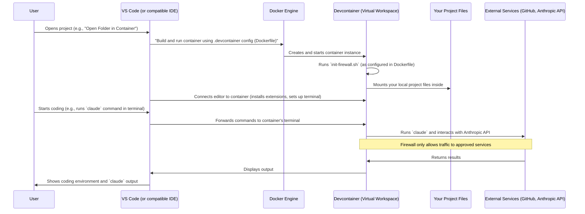

# Chapter 6: Development Container (Devcontainer)

Welcome back, intrepid developer! In our last chapter, [Issue Templates](05_issue_templates_.md), we learned how to gather consistent and valuable information from users reporting issues. That's about making sure your *inputs* are good. But what about the *environment* where you actually write code and fix those issues?

Imagine you're building something important, and you need a very specific set of tools, perfectly arranged, with all the right instructions. If every builder on the team uses their own tools, or has them organized differently, things can get messy. One person might have version A of a tool, another version B, and suddenly, "it works on my machine!" becomes a frequent, frustrating cry. This is the problem a **Development Container (Devcontainer)** solves.

### The Problem: "It Works on My Machine!"

As a software developer, you often need specific software installed: a particular version of Node.js, a certain database, specific command-line tools like Git or the GitHub CLI, and, of course, our smart assistant, the [Claude Code Agent/Application](01_claude_code_agent_application_.md).

But what if:
*   A new teammate joins and spends days trying to install everything correctly on their computer?
*   Your project requires Node.js v18, but your local machine uses v20 for another project?
*   A specific tool is missing or configured differently on a colleague's machine, leading to bugs that only appear for them?
*   You want to try out a new, experimental tool without "messing up" your main computer setup?

These inconsistencies cause delays, errors, and a lot of wasted time. They also make it harder to onboard new team members efficiently.

### What is a Development Container (Devcontainer)?

A **Development Container** (often just called a "Devcontainer") provides a consistent, reproducible, and isolated development environment for your project.

Think of it like this:
*   **A Virtual Workspace:** Instead of working directly on your computer's main operating system, you work inside a perfectly configured "virtual office" or "mini-computer" that's dedicated to your project.
*   **All Tools Included:** This virtual office comes pre-loaded with *everything* your project needs: the correct programming language versions (like Node.js), specific libraries, command-line tools (like `git` and `gh`), and our [Claude Code Agent/Application](01_claude_code_agent_application_.md).
*   **Consistent for Everyone:** Every developer on the team, regardless of their personal computer setup (Mac, Windows, Linux), gets the *exact same* development environment. No more "it works on my machine but not yours!"
*   **Isolated:** Changes you make inside the Devcontainer don't affect your main computer. If you mess something up, you can simply restart the container.

Devcontainers leverage a technology called **Docker**. You can think of Docker as creating lightweight, self-contained "boxes" where you can package software and its dependencies. A Devcontainer is essentially one of these Docker "boxes" specifically set up for development, and usually integrated seamlessly with your code editor (like Visual Studio Code).

### Our Use Case: A Consistent Claude Code Development Environment

For the `claude-code` project, we need a specific environment. We need Node.js, `npm`, Git, the GitHub CLI (`gh`), and of course, `claude-code` itself. We also have a special security requirement: to control network access for `claude` and other tools using a firewall.

A Devcontainer ensures that when you start working on `claude-code`, you immediately have:
*   The right version of Node.js.
*   `claude-code` installed and ready.
*   `gh` CLI for interacting with GitHub.
*   A pre-configured firewall to manage network access for security.

All this, without manually installing or configuring anything on your local machine!

### How to Use Devcontainers (Creating the Setup)

Devcontainers are typically defined by a special folder in your project's root called `.devcontainer/`. Inside this folder, you'll usually find two main files:

1.  **`Dockerfile`**: This is like the **blueprint** for our "virtual office." It contains step-by-step instructions on how to build the container: what operating system to start with, what software to install, and how to configure it.
2.  **`devcontainer.json`**: This is the **configuration file** for your code editor (e.g., VS Code). It tells the editor *how* to connect to and use the Devcontainer, including which `Dockerfile` to use, what extensions to install inside the container, and special settings. (Even though we don't show `devcontainer.json` code here, it's a vital part of the setup.)

Let's look at parts of the `Dockerfile` from the `claude-code` project to understand how our development environment is built.

```dockerfile
# .devcontainer/Dockerfile
FROM node:20 # Start with an image that has Node.js version 20

# Install essential tools like git, GitHub CLI (gh), and more
RUN apt-get update && apt-get install -y --no-install-recommends \
  git \
  gh \
  # ... (other tools like less, procps, sudo, fzf, zsh, etc.)
  && apt-get clean && rm -rf /var/lib/apt/lists/*

# Install Claude Code globally
ARG CLAUDE_CODE_VERSION=latest
RUN npm install -g @anthropic-ai/claude-code@${CLAUDE_CODE_VERSION}

# Copy and set up our custom firewall script
COPY init-firewall.sh /usr/local/bin/
USER root
RUN chmod +x /usr/local/bin/init-firewall.sh && \
  echo "node ALL=(root) NOPASSWD: /usr/local/bin/init-firewall.sh" > /etc/sudoers.d/node-firewall && \
  chmod 0440 /etc/sudoers.d/node-firewall
USER node
```

Let's break down this `Dockerfile`:

*   **`FROM node:20`**: This is the starting point. It tells Docker to base our container on a pre-built image that already has Node.js version 20 installed. This saves us from installing Node.js from scratch.
*   **`RUN apt-get update && apt-get install -y ...`**: These commands update the package list and then install common Linux tools like `git` (for version control), `gh` (the GitHub command-line tool), and other utilities. This ensures all developers have these essential tools.
*   **`RUN npm install -g @anthropic-ai/claude-code@${CLAUDE_CODE_VERSION}`**: This is crucial! It uses `npm` (Node.js package manager) to globally install our [Claude Code Agent/Application](01_claude_code_agent_application_.md) inside the container. This means Claude Code is ready to use immediately.
*   **`COPY init-firewall.sh /usr/local/bin/`**: This copies a custom script named `init-firewall.sh` (which we'll look at next) into a location where it can be executed.
*   **`USER root` and `USER node`**: These commands switch between the `root` user (for installing system-wide software or setting permissions) and a non-root `node` user (for daily development, which is more secure).
*   **`chmod +x ...` and `echo "node ALL=(root) NOPASSWD: ..." > /etc/sudoers.d/node-firewall`**: These lines make the firewall script executable and configure `sudo` so the `node` user can run the firewall script without needing a password. This is important for security management within the container.

### The Custom Firewall Script (`init-firewall.sh`)

For security and controlled network access, the `claude-code` project uses a custom firewall script. This script ensures that the tools within the Devcontainer (especially Claude Code, which communicates with external APIs) can only reach approved destinations (like GitHub or Anthropic's API servers), blocking all other outbound network traffic.

Here are simplified parts of the `init-firewall.sh` script:

```bash
# .devcontainer/init-firewall.sh
#!/bin/bash

# Flush existing rules and delete existing ipsets
iptables -F # Clears existing firewall rules
iptables -X # Deletes any custom firewall chains
ipset destroy allowed-domains 2>/dev/null || true # Clears a list of allowed IP addresses

# Allow basic services first (DNS, localhost, SSH)
iptables -A OUTPUT -p udp --dport 53 -j ACCEPT # Allow outbound DNS queries
iptables -A INPUT -p udp --sport 53 -j ACCEPT # Allow inbound DNS responses
iptables -A INPUT -i lo -j ACCEPT # Allow localhost traffic
iptables -A OUTPUT -o lo -j ACCEPT # Allow localhost traffic

# Create a list (ipset) for allowed IP ranges
ipset create allowed-domains hash:net

# Fetch GitHub's official IP ranges and add them to the allowed-domains list
echo "Fetching GitHub IP ranges..."
# ... (commands to fetch GitHub IPs using 'curl' and add them to ipset)

# Resolve and add other allowed domains (e.g., Anthropic API, npm registry)
for domain in \
    "registry.npmjs.org" \
    "api.anthropic.com" \
    # ... (other domains like sentry.io, statsig.anthropic.com)
    ; do
    echo "Resolving $domain..."
    # ... (commands to resolve domain to IP and add to ipset)
done

# Set default policies to DROP traffic (deny everything else)
iptables -P INPUT DROP
iptables -P FORWARD DROP
iptables -P OUTPUT DROP

# Allow established connections and traffic to our 'allowed-domains' list
iptables -A INPUT -m state --state ESTABLISHED,RELATED -j ACCEPT
iptables -A OUTPUT -m state --state ESTABLISHED,RELATED -j ACCEPT
iptables -A OUTPUT -m set --match-set allowed-domains dst -j ACCEPT

# Explicitly REJECT all other outbound traffic
iptables -A OUTPUT -j REJECT --reject-with icmp-admin-prohibited
```

This script works like a strict security guard for your container's network:
*   **`iptables -F`**: It first clears any old firewall rules.
*   **Allow Essential Services**: It explicitly allows necessary traffic like DNS (to look up website addresses), `localhost` (for internal communication), and SSH (for secure connections if needed).
*   **`ipset create allowed-domains hash:net`**: It creates a special list called `allowed-domains` that can hold IP addresses and ranges.
*   **Fetch & Add IPs**: It automatically fetches the official IP addresses for services like GitHub and adds them to `allowed-domains`. It also resolves and adds IPs for `registry.npmjs.org` (where Node.js packages come from) and `api.anthropic.com` (where Claude Code talks to the AI model).
*   **`iptables -P OUTPUT DROP`**: This is a very important line! It sets the *default* behavior for outbound traffic to "DROP," meaning it blocks everything by default.
*   **Allow Approved Traffic**: It then adds rules to allow traffic *only* to the IP addresses listed in our `allowed-domains` set.
*   **`iptables -A OUTPUT -j REJECT ...`**: Any traffic not explicitly allowed is then rejected.

This firewall setup inside the Devcontainer provides an extra layer of security, ensuring that sensitive operations (like those involving API keys for [Claude Code Agent/Application](01_claude_code_agent_application_.md)) can only communicate with trusted services.

### Under the Hood: How Your Devcontainer Works

When you open a project that has a `.devcontainer` folder in a compatible code editor (like VS Code with the Remote - Containers extension), here's what happens:



1.  **You Start the Container:** You open your `claude-code` project in VS Code and choose the option "Reopen in Container" (or similar).
2.  **VS Code Reads Instructions:** VS Code finds the `.devcontainer` folder and reads the `devcontainer.json` file. It then tells the Docker Engine to build and start the container according to the `Dockerfile`.
3.  **Docker Builds & Runs:** The Docker Engine uses the `Dockerfile` to create a new container instance. During this process, all the `RUN` commands (installing Node.js, Git, `gh`, `claude-code`, and copying the firewall script) are executed.
4.  **Firewall Activation:** The `init-firewall.sh` script is run, setting up the network security rules within the container.
5.  **Project Files Mounted:** Your actual project files from your local computer are "mounted" or shared directly into the running container. This means you edit files on your computer, but the tools inside the container see and work with them.
6.  **VS Code Connects:** VS Code then establishes a connection to this running container. Your terminal, extensions, and all coding operations now happen *inside* this isolated environment.
7.  **You Code!** When you type `claude` in your VS Code terminal, the command is executed within the Devcontainer, using its installed `claude-code` version, under its firewall rules, and interacting with your mounted project files.

### Why Use a Devcontainer?

| Feature              | Without Devcontainer                               | With Devcontainer                                      |
| :------------------- | :------------------------------------------------- | :----------------------------------------------------- |
| **Consistency**      | Varies by developer's local machine setup          | Identical environment for all developers               |
| **Reproducibility**  | Hard to guarantee for bug reproduction             | Easy to reproduce bugs in the same environment         |
| **Onboarding**       | Time-consuming setup of tools and dependencies     | Quick start; environment is ready-to-code in minutes   |
| **Isolation**        | Project dependencies can conflict with other projects | Each project has its dedicated, clean environment      |
| **Security**         | Limited control over network traffic for dev tools | Custom firewall rules can restrict outbound access     |
| **"Works on my machine"** | Common problem, hard to debug                    | Virtually eliminated; environment is the same for everyone |

### Conclusion

In this chapter, you've learned about Development Containers (Devcontainers), your project's perfectly configured "virtual workspace." You now understand that a Devcontainer provides a consistent, reproducible, and isolated environment, tackling the frustrating "it works on my machine" problem. We explored how `Dockerfile` defines the container's contents (installing Node.js, `git`, `gh`, and [Claude Code Agent/Application](01_claude_code_agent_application_.md)) and how a custom firewall script (`init-firewall.sh`) adds a crucial layer of security. By using Devcontainers, you ensure every developer has the exact same tools and settings, streamlining onboarding and making development more reliable.

This marks the end of our beginner-friendly tutorial on the core concepts of the `claude-code` project. We've journeyed from understanding the intelligent [Claude Code Agent/Application](01_claude_code_agent_application_.md) and its powerful [Claude Code Slash Commands](02_claude_code_slash_commands_.md), through automating tasks with [GitHub Actions Workflows](03_github_actions_workflows_.md) and [GitHub Automation Scripts (Issue Management)](04_github_actions_workflows_.md), ensuring good data with [Issue Templates](05_issue_templates_.md), and finally, setting up a consistent coding environment with Devcontainers. You now have a foundational understanding of how these powerful tools come together to make coding with Claude Code efficient, automated, and collaborative!

---

<sub><sup>Generated by [AI Codebase Knowledge Builder](https://github.com/The-Pocket/Tutorial-Codebase-Knowledge).</sup></sub> <sub><sup>**References**: [[1]](https://github.com/anthropics/claude-code/blob/f73eee0ead76eec52b7d2852ff643fa98a49f75f/.devcontainer/Dockerfile), [[2]](https://github.com/anthropics/claude-code/blob/f73eee0ead76eec52b7d2852ff643fa98a49f75f/.devcontainer/init-firewall.sh)</sup></sub>