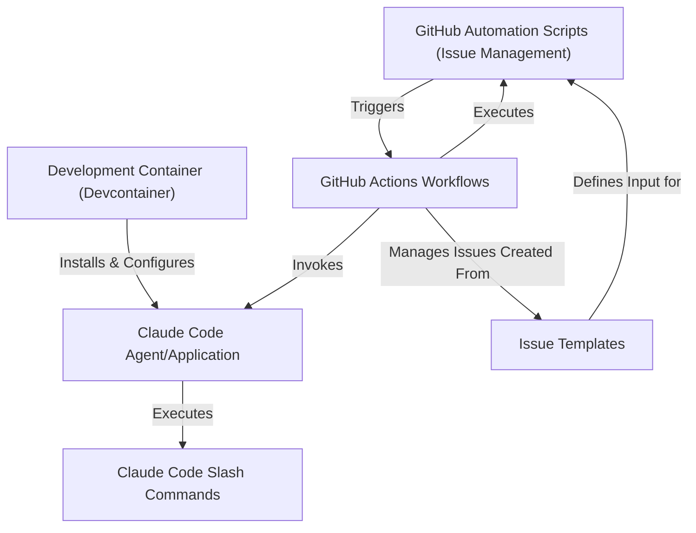

Tutorial: claude-code

`Claude Code` is an **intelligent coding assistant** that lives in your terminal, acting as a *smart companion* for developers. It **automates complex coding and Git tasks** using natural language commands, and integrates with *GitHub for issue management*, making development faster and more efficient.

## Visual Overview

## Chapters

1. [Claude Code Agent/Application
](01_claude_code_agent_application_.md)
2. [Claude Code Slash Commands
](02_claude_code_slash_commands_.md)
3. [GitHub Actions Workflows
](03_github_actions_workflows_.md)
4. [GitHub Automation Scripts (Issue Management)
](04_github_automation_scripts__issue_management__.md)
5. [Issue Templates
](05_issue_templates_.md)
6. [Development Container (Devcontainer)
](06_development_container__devcontainer__.md)

---

Generated by [AI Codebase Knowledge Builder](https://github.com/The-Pocket/Tutorial-Codebase-Knowledge).