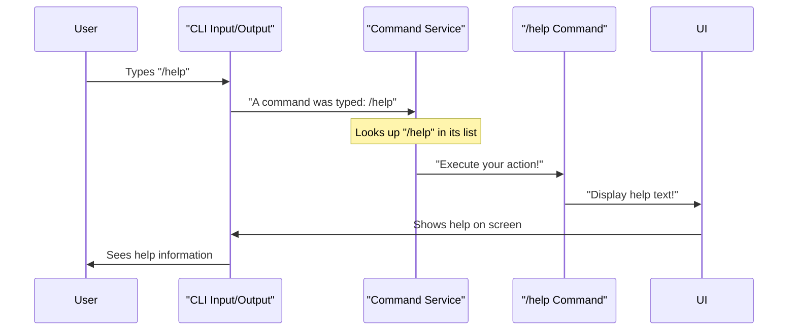

# Chapter 1: CLI Commands

Imagine you're using a super smart assistant. Most of the time, you just talk to it naturally. But what if you want to tell the assistant *how* to do its job, like "save this conversation" or "clear the whiteboard"? That's exactly what **CLI Commands** are for in Gemini CLI!

They are special instructions you type into the command line, not to talk to the AI, but to control the Gemini CLI application itself. These commands let you manage your conversations, customize how the CLI works, and perform helpful tasks.

### Why Do We Need Commands?

Think of Gemini CLI as your AI co-pilot. You'll spend most of your time chatting with it, asking questions, and getting code suggestions. But sometimes, you need to:

*   **Ask for help:** "What can this co-pilot do?"
*   **Manage your workspace:** "Where are my files?"
*   **Change settings:** "Make the text bigger!"
*   **Clear the screen:** "Let's start fresh."
*   **Save your progress:** "Remember this conversation for later!"

CLI Commands are how you give these "meta-instructions" to Gemini CLI.

### Understanding the Different Types of Commands

Gemini CLI uses special symbols to tell the difference between talking to the AI and giving an instruction to the CLI itself. There are three main types, each with a different starting symbol:

1.  **Slash Commands (`/`): Control the CLI's features.**
    These are the most common type. They help you manage your session, change settings, or access built-in tools. Think of them as your control panel.
    *   **Examples:** `/help`, `/settings`, `/chat`, `/clear`.

2.  **At Commands (`@`): Include files or directories in your prompt.**
    These commands are super useful when you want the AI to analyze specific code or text files from your project. Instead of copying and pasting, you just point to the file!
    *   **Examples:** `@my_code.js`, `@src/utils/`, `@README.md`.

3.  **Exclamation Commands (`!`): Run regular shell commands.**
    Sometimes you need to quickly run a command on your computer's operating system (like `ls` to list files or `git status` to check your code repository) without leaving Gemini CLI. This command lets you do that.
    *   **Examples:** `!ls -la`, `!git status`.

Let's dive into how to use them!

### Your First Commands: Getting Help and Managing Your Chat

Let's say you just opened Gemini CLI and you're not sure what to do. The first command you'll likely use is `/help`.

**Use Case: Getting Started and Managing Conversations**

You want to:
1.  See a list of available commands.
2.  Clear the screen for a fresh start.
3.  Have a chat with the AI and then save that conversation to come back to it later.
4.  Resume a previously saved conversation.
5.  Exit the application when you're done.

#### 1. Getting Help with `/help`

To see what Gemini CLI can do, just type `/help` and press Enter:

```
/help
```

**What happens:** Gemini CLI will display a list of all available commands, along with a short description for each. This is your go-to reference if you forget a command!

#### 2. Clearing the Screen with `/clear`

Conversations can get long. To clear the visual history in your terminal and get a clean slate, use `/clear`:

```
/clear
```

**What happens:** The terminal screen will be wiped clean. Don't worry, your conversation history (for scrolling back or saving) is usually still there, but the visible part is gone. You can also press `Ctrl+L` as a keyboard shortcut!

#### 3. Saving and Resuming Conversations with `/chat`

This is a powerful command that helps you manage your ongoing discussions with the AI. It has sub-commands (like `/chat save` or `/chat list`).

Let's start a conversation and then save it:

```
> Hi Gemini, can you give me a simple Python function to add two numbers?
```
*(Gemini CLI responds with a Python function)*

Now, let's save this conversation. You need to give it a unique name (a "tag") so you can find it later. Let's call it `add-function`.

```
/chat save add-function
```

**What happens:** Gemini CLI saves your entire conversation up to this point under the tag `add-function`. You'll see a message confirming it was saved.

A few days later, you open Gemini CLI and want to continue that specific conversation. First, you might want to see what conversations you've saved:

```
/chat list
```

**What happens:** Gemini CLI shows you a list of all your saved conversation tags, like `add-function`.

Now, let's bring back the `add-function` conversation:

```
/chat resume add-function
```

**What happens:** The conversation history for `add-function` will be loaded, and you can pick up exactly where you left off!

#### 4. Exiting with `/quit`

When you're finished, you can gracefully exit Gemini CLI:

```
/quit
```

**What happens:** The Gemini CLI application will close. You can also use `/exit`.

### Including Files in Your AI Prompt with At Commands (`@`)

This is incredibly useful for asking the AI questions about your code or documents.

**Use Case: Asking the AI about a specific file.**

Let's say you have a Python file named `my_script.py` in your current directory, and you want Gemini to explain it.

```python
# my_script.py
def calculate_area(radius):
    """Calculates the area of a circle."""
    pi = 3.14159
    return pi * radius * radius

def greet(name):
    print(f"Hello, {name}!")
```

To ask the AI about it, you'd type:

```
@my_script.py Explain what this Python script does.
```

**What happens:** Gemini CLI reads the content of `my_script.py`, inserts it into your prompt, and then sends the complete prompt (including the file content) to the AI. The AI will then explain the script.

You can also include an entire directory! If you had a folder `src/` with many files:

```
@src/ Summarize the main purpose of the code in this directory.
```

**What happens:** Gemini CLI will look through the `src/` directory (and its subdirectories), read the relevant files, and send their combined content to the AI with your prompt. This is super handy for getting a high-level overview of a project.

### Running System Commands with Exclamation Commands (`!`)

Sometimes, you just need to run a quick command on your computer without closing Gemini CLI.

**Use Case: Listing files in your current directory.**

To list the files in your current directory, you'd usually type `ls` (on Linux/macOS) or `dir` (on Windows) in your regular terminal. With Gemini CLI, you can do this using `!`:

```
!ls -la
```

**What happens:** Gemini CLI pauses its AI interaction, runs the `ls -la` command, displays its output (e.g., a detailed list of files and folders), and then returns you to the Gemini CLI prompt.

You can also enter a "shell mode" by typing `!` on its own:

```
!
```

**What happens:** The Gemini CLI prompt changes, indicating you are now in shell mode. Anything you type will be directly executed as a shell command until you type `!` again to exit shell mode. This is useful for running several shell commands in a row.

### How Commands Work Under the Hood (A Sneak Peek)

When you type a command like `/help`, a few things happen very quickly behind the scenes. Think of it like this:

1.  **You type:** You enter `/help` into the input bar.
2.  **The Listener:** Gemini CLI is constantly listening for your input. It sees the `/` and knows you're trying to use a command.
3.  **The Command Manager:** A special part of the CLI, called the `CommandService`, is like a directory of all available commands. It quickly looks up `/help`.
4.  **The Command's "Action":** Each command has a specific "action" or function associated with it. For `/help`, this action is to display the help text. The `CommandService` tells the `/help` command to perform its action.
5.  **Result Display:** The UI then updates, showing you the help information.

Here's a simplified diagram of that process:



#### Inside the Code (Simplified)

Gemini CLI is built with organized components. Commands are defined in specific places:

*   **Built-in Commands:** The basic commands like `/help`, `/clear`, and `/chat` are hard-coded into the application. They are loaded by something called a `BuiltinCommandLoader`.

    Let's look at a tiny piece of how the `/help` command is defined. This is a very simplified version to show the key parts:

    ```typescript
    // In packages/cli/src/ui/commands/helpCommand.ts
    // (Actual file has more details, but this shows the core)

    import { CommandKind } from './types.js'; // Imports the type definition for commands

    export const helpCommand = {
      name: 'help',
      altNames: ['?'], // You can also type /?
      description: 'Display help information about Gemini CLI.',
      kind: CommandKind.BUILT_IN, // This command is built into the CLI
      action: async (context, args) => {
        // ... (code to actually display the help dialog)
        return { type: 'dialog', dialog: 'help' }; // Tells the UI to open the help dialog
      },
      // ... (other optional parts like completion)
    };
    ```
    This snippet shows that `/help` has a `name`, a `description`, and an `action`. The `action` is a function that tells the CLI what to *do* when `/help` is typed. In this case, it opens a 'help' dialog.

*   **Command Definition:** All commands, whether built-in or custom, follow a structure defined by the `SlashCommand` interface. This ensures consistency.

    ```typescript
    // In packages/cli/src/ui/commands/types.ts (Simplified)
    interface SlashCommand {
      name: string; // The command name, e.g., "help"
      description: string; // What the command does
      kind: CommandKind; // Is it built-in, from a file, etc.?
      action?: (context: CommandContext, args: string) => // What happens when you run it
        | void
        | SlashCommandActionReturn
        | Promise<void | SlashCommandActionReturn>;
      // ... other optional fields like subCommands, completion
    }

    enum CommandKind {
      BUILT_IN = 'built-in',
      FILE = 'file',
      // ... other types
    }
    ```
    This `SlashCommand` interface is like a blueprint, ensuring every command has a name, description, and an `action` function that defines its behavior. The `CommandKind` helps categorize where the command comes from.

*   **Command Orchestration:** The `CommandService` is the central brain that brings all these commands together. It gathers commands from different sources (like built-in ones, or even custom ones you create in files!).

    ```typescript
    // In packages/cli/src/services/CommandService.ts (Simplified)
    import type { SlashCommand } from '../ui/commands/types.js';
    import type { ICommandLoader } from './types.js';

    export class CommandService {
      private constructor(private readonly commands: readonly SlashCommand[]) {}

      static async create(
        loaders: ICommandLoader[], // List of things that can load commands
        signal: AbortSignal,
      ): Promise<CommandService> {
        const allCommands: SlashCommand[] = [];
        // ... code to load commands from all loaders ...
        // ... code to handle conflicts (e.g., if two commands have the same name) ...
        const finalCommands = Object.freeze(Array.from(commandMap.values()));
        return new CommandService(finalCommands);
      }

      getCommands(): readonly SlashCommand[] {
        return this.commands; // Returns all available commands
      }
    }
    ```
    The `CommandService` takes various `ICommandLoader` objects (like `BuiltinCommandLoader`) and asks them to `loadCommands`. It then collects all these commands, makes sure there are no naming conflicts, and stores them so that when you type a command, it can quickly find and execute the correct one.

### Conclusion

You've just learned about the fundamental way to interact with Gemini CLI itself: **CLI Commands**! You now know about the three main types (`/`, `@`, `!`) and what they're used for. You've also seen how to get help, clear your screen, manage your conversations, inject file content into prompts, and even run system commands. These commands are your toolkit for effectively navigating and controlling your Gemini CLI experience.

Next, we'll explore how to fine-tune your Gemini CLI experience using settings, which you'll often access using a slash command!

[Next Chapter: Settings Management](02_settings_management_.md)

---

<sub><sup>Generated by [AI Codebase Knowledge Builder](https://github.com/The-Pocket/Tutorial-Codebase-Knowledge).</sup></sub> <sub><sup>**References**: [[1]](https://github.com/google-gemini/gemini-cli/blob/d37fff7fd60fd1e9b69f487d5f23b1121792d331/docs/cli/commands.md), [[2]](https://github.com/google-gemini/gemini-cli/blob/d37fff7fd60fd1e9b69f487d5f23b1121792d331/packages/cli/src/services/BuiltinCommandLoader.ts), [[3]](https://github.com/google-gemini/gemini-cli/blob/d37fff7fd60fd1e9b69f487d5f23b1121792d331/packages/cli/src/services/CommandService.ts), [[4]](https://github.com/google-gemini/gemini-cli/blob/d37fff7fd60fd1e9b69f487d5f23b1121792d331/packages/cli/src/services/FileCommandLoader.ts), [[5]](https://github.com/google-gemini/gemini-cli/blob/d37fff7fd60fd1e9b69f487d5f23b1121792d331/packages/cli/src/services/McpPromptLoader.ts), [[6]](https://github.com/google-gemini/gemini-cli/blob/d37fff7fd60fd1e9b69f487d5f23b1121792d331/packages/cli/src/ui/commands/types.ts)</sup></sub>