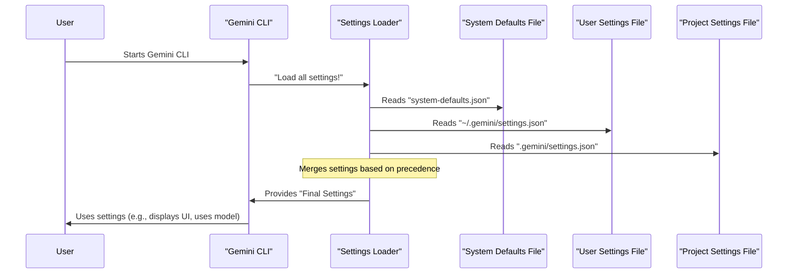

# Chapter 2: Settings Management

In [Chapter 1: CLI Commands](01_cli_commands_.md), you learned how to give instructions *to* Gemini CLI itself, like `/help` or `/chat save`. Now, imagine you want to customize *how* Gemini CLI behaves across all your projects, or even just for one specific project. For example, maybe you always want to use a specific AI model, or you prefer a certain color theme for the application.

How do you tell Gemini CLI these preferences so it remembers them? That's exactly what **Settings Management** is for! It's the system that handles all your choices, making sure the application runs just the way you like it.

### Why Do We Need Settings?

Think of Gemini CLI as your personal workshop. You use tools (the AI model) and have a workbench (the UI). Over time, you'll develop preferences:

*   **Your Favorite Tools:** You might prefer a faster AI model for quick chats and a more powerful one for complex coding tasks.
*   **Your Workspace Setup:** You might like a dark theme, or want line numbers to show in code blocks.
*   **Project-Specific Rules:** A specific project might need special AI instructions or tools.

Settings management allows you to define these preferences once, and Gemini CLI will automatically use them. This saves you from typing the same options every time you start a new session.

### The Idea: Settings Layers

Gemini CLI understands that some settings are more important or specific than others. It uses a "layer" system, where settings from more specific places will override settings from more general places.

Imagine you have a set of family rules (like "no shoes in the house"). Then, you have your own room rules ("keep my desk tidy"). Your room rules are more specific and might add to or even slightly change a family rule within your room.

Gemini CLI works similarly with settings:

| Setting Layer         | Description                                                                                                                                                                | Overrides                                                                                                                                                                          |
| :-------------------- | :------------------------------------------------------------------------------------------------------------------------------------------------------------------------- | :--------------------------------------------------------------------------------------------------------------------------------------------------------------------------------- |
| **Defaults**          | The basic, built-in settings that come with Gemini CLI. Like the default "factory settings."                                                                                  | Nothing; they are the baseline.                                                                                                                                                    |
| **System Defaults**   | System-wide default settings, often set by an IT admin for an organization. These provide a general starting point for everyone on a specific computer or network.             | Built-in defaults.                                                                                                                                                                 |
| **User Settings**     | Your personal preferences. These apply to *all* your Gemini CLI sessions, no matter which project you're working on.                                                         | System defaults and built-in defaults.                                                                                                                                             |
| **Project Settings**  | Settings specific to the project folder you are currently in. These are super useful for tailoring Gemini CLI's behavior to the needs of a single codebase or task.           | User settings, system defaults, and built-in defaults. They are the most specific *persistent* settings.                                                                           |
| **System Settings**   | System-wide override settings. These are powerful settings, typically set by system administrators, that override *all* other settings files on the system.                   | All other settings files (user, project, system defaults, built-in defaults).                                                                                                      |
| **Environment Variables** | Values set in your computer's environment (e.g., `GEMINI_API_KEY`). Can be loaded from `.env` files.                                                                     | All settings files. Very flexible for temporary changes or sensitive data.                                                                                                         |
| **Command-Line Arguments** | Options you type directly when starting Gemini CLI (e.g., `gemini --model gemini-1.5-pro`). These are temporary and only last for that one session.                    | All other settings, including environment variables. These are the *most specific* and highest priority settings.                                                                  |

This hierarchy ensures that project-specific needs (Project Settings) take precedence over your general preferences (User Settings), and anything you type directly (Command-Line Arguments) will always apply for that one time.

### Where Do Settings Live? (`settings.json`)

Most of your persistent settings are stored in special files named `settings.json`. These are simple text files that Gemini CLI reads.

The two most common `settings.json` files you'll interact with are:

1.  **Your User Settings File:**
    *   **Location:** `~/.gemini/settings.json` (The `~` means your home directory).
    *   **What it does:** Stores your global preferences, like your favorite AI model, your UI theme, or general UI preferences. These apply to *all* your projects.

2.  **Your Project Settings File:**
    *   **Location:** `.gemini/settings.json` inside your project's root directory.
    *   **What it does:** Stores settings specific to *that particular project*. For example, if one project requires a specific sandbox environment or a different default AI model.

There are also system-wide `settings.json` files, but as a beginner, you'll mostly focus on your user and project files.

### Use Case: Setting Your Default AI Model and UI Theme

Let's say you want Gemini CLI to always use the `gemini-1.5-flash` model and the `DefaultDark` theme. You can do this by editing your user settings file.

#### 1. Locating and Opening Your User Settings File

First, you need to find your user settings file. It's usually located at `~/.gemini/settings.json`.

You can open this file with your favorite text editor. For example, if you use Visual Studio Code, you might type:

```bash
code ~/.gemini/settings.json
```

If the file doesn't exist yet, don't worry! You can create it.

#### 2. Editing `settings.json`

Once opened, your `settings.json` file might be empty, or it might contain some existing settings. To set your preferred model and theme, you would add or modify it to look something like this:

```json
{
  "model": {
    "name": "gemini-1.5-flash"
  },
  "ui": {
    "theme": "DefaultDark"
  }
}
```

**What happens:**
*   `"model"`: This is a category for settings related to the AI model.
*   `"name": "gemini-1.5-flash"`: Inside the `model` category, you're setting the `name` of the model to `gemini-1.5-flash`.
*   `"ui"`: This is a category for settings related to the user interface.
*   `"theme": "DefaultDark"`: Inside the `ui` category, you're setting the `theme` to `DefaultDark`.

Save the file after making these changes. The next time you start Gemini CLI, it will load these settings and use `gemini-1.5-flash` as the default model and `DefaultDark` as the theme!

#### 3. Temporarily Overriding Settings with Command-Line Arguments

What if you usually prefer `gemini-1.5-flash`, but for one specific session, you want to try `gemini-1.5-pro`? You don't need to change your `settings.json` file. You can use a command-line argument:

```bash
gemini --model gemini-1.5-pro
```

**What happens:** For *this single session*, Gemini CLI will ignore the `model.name` you set in `settings.json` and use `gemini-1.5-pro` instead, because command-line arguments have the highest priority. When you restart Gemini CLI without this argument, it will go back to using `gemini-1.5-flash` as defined in your user settings.

### Under the Hood: How Settings Are Managed

When Gemini CLI starts, it performs a clever dance to figure out all your settings.

#### Step-by-Step Walkthrough

1.  **"Hello, CLI!"**: You start `gemini-cli`.
2.  **Looking for Settings Files**: Gemini CLI immediately looks for all the `settings.json` files in their predefined locations (system defaults, user, project, etc.).
3.  **Loading the Pieces**: It reads the content of each `settings.json` file.
4.  **Merging Time!**: Now, it combines all these settings. Like a chef blending ingredients, it prioritizes the "fresher" (more specific) settings. If your project `settings.json` says `model.name` is `gemini-1.5-pro`, but your user `settings.json` says `gemini-1.5-flash`, the project setting wins!
5.  **Environment Variables & Arguments**: After merging the files, it checks for any environment variables (`GEMINI_MODEL`) and then command-line arguments (`--model`). These override anything loaded from files.
6.  **Final Recipe**: The result is a single, complete set of instructions that Gemini CLI will use for your session.

Here's a simplified diagram of this process:



#### Inside the Code (Simplified)

The core logic for loading and merging settings is handled in files like `packages/cli/src/config/settings.ts`.

1.  **Loading from Different Paths**: The `loadSettings` function is responsible for finding and reading all the settings files.

    ```typescript
    // In packages/cli/src/config/settings.ts (Simplified)
    import * as fs from 'node:fs';
    import { homedir } from 'node:os';

    // ... (other imports and helper functions)

    export function loadSettings(/* ... */): LoadedSettings {
      // ... (code to determine paths like USER_SETTINGS_PATH, etc.)

      const loadAndMigrate = (
        filePath: string,
        scope: SettingScope,
      ): { settings: Settings; rawJson?: string } => {
        // ... (reads file, parses JSON, handles errors, and old format migration)
        if (fs.existsSync(filePath)) {
          const content = fs.readFileSync(filePath, 'utf-8');
          const rawSettings: unknown = JSON.parse(content);
          // ... (simplified for tutorial)
          return { settings: rawSettings as Settings, rawJson: content };
        }
        return { settings: {} };
      };

      const systemResult = loadAndMigrate(getSystemSettingsPath(), SettingScope.System);
      const userResult = loadAndMigrate(USER_SETTINGS_PATH, SettingScope.User);
      // ... (loads project and other settings similarly)

      // ... (rest of the function processes and merges)
    }
    ```
    This `loadSettings` function is like the detective, finding all the relevant `settings.json` files, reading their content, and handling any issues.

2.  **Merging with Precedence**: After loading, the `mergeSettings` function combines them according to the rules of precedence (project overrides user, user overrides system, etc.).

    ```typescript
    // In packages/cli/src/config/settings.ts (Simplified)
    import { customDeepMerge } from '../utils/deepMerge.js';
    import type { Settings } from './settingsSchema.js';

    function mergeSettings(
      system: Settings,
      systemDefaults: Settings,
      user: Settings,
      workspace: Settings, // This is project settings
      isTrusted: boolean, // Security check for workspace settings
    ): Settings {
      // workspace settings are only applied if the workspace is trusted
      const safeWorkspace = isTrusted ? workspace : ({} as Settings);

      // customDeepMerge intelligently combines objects, respecting merge strategies
      // The order matters here: later arguments override earlier ones.
      return customDeepMerge(
        /* ... merge strategy resolver ... */
        {}, // Starting point
        systemDefaults,
        user,
        safeWorkspace,
        system, // System settings (overrides) are last
      ) as Settings;
    }
    ```
    The `mergeSettings` function takes all the individual settings objects and uses a special `customDeepMerge` tool to combine them. Notice the order: `systemDefaults` come first, then `user`, then `safeWorkspace` (project), and finally `system` (global overrides). This reflects the precedence rules, where the last one wins if there's a conflict.

3.  **Making Settings Available**: Once all settings are loaded and merged into a `LoadedSettings` object, they are made available throughout the Gemini CLI application. For the user interface, React's Context API is used.

    ```typescript
    // In packages/cli/src/ui/contexts/SettingsContext.tsx (Simplified)
    import React, { useContext } from 'react';
    import type { LoadedSettings } from '../../config/settings.js';

    // Create a context to hold our loaded settings
    export const SettingsContext = React.createContext<LoadedSettings | undefined>(
      undefined,
    );

    // A handy hook for any UI component to easily get the current settings
    export const useSettings = () => {
      const context = useContext(SettingsContext);
      if (context === undefined) {
        throw new Error('useSettings must be used within a SettingsProvider');
      }
      return context;
    };
    ```
    This `SettingsContext` and `useSettings` hook allow any part of the Gemini CLI's user interface to easily access the currently active settings. For example, the UI component responsible for rendering the chat might use `useSettings().merged.ui.theme` to decide which colors to use.

### Conclusion

You've now learned how Gemini CLI manages its behavior through **Settings Management**! You understand the powerful concept of settings layers, where preferences cascade from general defaults to specific project settings and even temporary command-line overrides. You also know how to locate and edit your `settings.json` files to customize your `gemini-cli` experience permanently, and how environment variables and command-line arguments can temporarily change behavior. This foundational knowledge is crucial for tailoring Gemini CLI to your workflow.

Next, we'll dive deeper into the specific types of settings you can configure in Gemini CLI and explore the full `settings.json` structure in detail.

[Next Chapter: Configuration](03_configuration_.md)

---

<sub><sup>Generated by [AI Codebase Knowledge Builder](https://github.com/The-Pocket/Tutorial-Codebase-Knowledge).</sup></sub> <sub><sup>**References**: [[1]](https://github.com/google-gemini/gemini-cli/blob/d37fff7fd60fd1e9b69f487d5f23b1121792d331/docs/cli/configuration.md), [[2]](https://github.com/google-gemini/gemini-cli/blob/d37fff7fd60fd1e9b69f487d5f23b1121792d331/packages/cli/src/config/settings.ts), [[3]](https://github.com/google-gemini/gemini-cli/blob/d37fff7fd60fd1e9b69f487d5f23b1121792d331/packages/cli/src/ui/contexts/SettingsContext.tsx)</sup></sub>