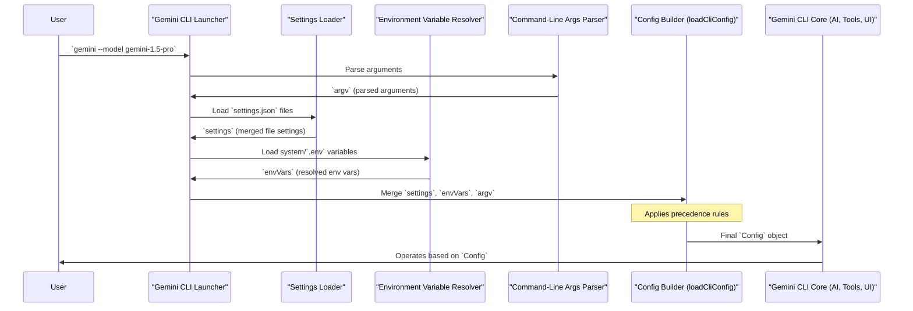

# Chapter 3: Configuration

In [Chapter 2: Settings Management](02_settings_management_.md), you learned how to customize Gemini CLI using `settings.json` files across different "layers" – from global user preferences to specific project rules. This system helps organize your choices.

But what happens when you have settings from a `settings.json` file, *and* you use an environment variable, *and* you type a command-line argument, all at the same time? How does Gemini CLI know which one to pick? This is where the concept of **Configuration** comes in!

### What is Configuration? The CLI's Master Plan

Think of **Configuration** as the ultimate, single "master plan" that Gemini CLI uses to operate in any given session. It's like the central brain, compiling all possible instructions and preferences from every source into one coherent blueprint.

While `settings.json` files let you *define* your preferences, the overall **Configuration** is the *result* of combining *all* sources of instructions, including:

*   **Default values:** The basic settings built into the application.
*   **Settings files:** Your `settings.json` files (system, user, project).
*   **Environment variables:** Values set in your computer's environment (e.g., `GEMINI_API_KEY`).
*   **Command-line arguments:** Options you type directly when starting `gemini-cli`.

This "master plan" dictates everything: which AI model to use, how to handle tool approvals, paths to important files, and even the UI theme. It ensures consistency and smooth operation, always prioritizing the most specific instruction.

Here’s a quick recap of the preference hierarchy, now seen as inputs to the final Configuration:

| Configuration Source        | Precedence (Lower is overridden) |
| :-------------------------- | :------------------------------- |
| **Default values**          | 1 (Lowest)                       |
| **System defaults file**    | 2                                |
| **User settings file**      | 3                                |
| **Project settings file**   | 4                                |
| **System settings file**    | 5                                |
| **Environment variables**   | 6                                |
| **Command-line arguments**  | 7 (Highest)                      |

### The Heart of Gemini CLI: The `Config` Object

Inside Gemini CLI, all these merged instructions are held in a special, single object called `Config`. This `Config` object is the "single source of truth" for the entire application during a session. Every part of Gemini CLI – from the AI model interaction to the user interface and tool execution – refers to this `Config` object to understand how it should behave.

### Use Case: Building a Unified Plan

Let's imagine a scenario where you want to:
1.  **Globally prefer** the `DefaultDark` UI theme and the `gemini-1.5-flash` model. (Set in your `~/.gemini/settings.json`)
2.  Have a **sensitive project** where you *always* want to enable sandboxing for safety. (Set in your project's `.gemini/settings.json`)
3.  Need to provide your **API key**, which should never be stored directly in a settings file. (Set as an environment variable)
4.  For a **one-off task**, you want to temporarily use `gemini-1.5-pro` and enable debug mode. (Set as command-line arguments)

Here's how these pieces of information would be defined:

#### 1. Global Preferences (User `settings.json`)

```json
// ~/.gemini/settings.json
{
  "ui": {
    "theme": "DefaultDark"
  },
  "model": {
    "name": "gemini-1.5-flash"
  }
}
```
**What this does:** This sets your personal default UI theme and AI model.

#### 2. Project-Specific Security (Project `settings.json`)

```json
// my-sensitive-project/.gemini/settings.json
{
  "tools": {
    "sandbox": "docker" // Forces sandboxing for this project
  }
}
```
**What this does:** This setting is specific to `my-sensitive-project` and overrides your user settings for the `tools.sandbox` property.

#### 3. Secret API Key (Environment Variable)

You'd typically set this in your shell's profile file (like `.bashrc` or `.zshrc`) or a `.env` file:

```bash
export GEMINI_API_KEY="YOUR_SUPER_SECRET_KEY_HERE"
```
**What this does:** This makes your API key available to Gemini CLI, but it's not stored directly in a text file within your project.

#### 4. One-off Overrides (Command-Line Arguments)

When you launch Gemini CLI for a specific task:

```bash
gemini --model gemini-1.5-pro --debug
```
**What this does:**
*   `--model gemini-1.5-pro`: Temporarily overrides the model specified in *both* your user and project `settings.json` files for *this session only*.
*   `--debug`: Activates debug mode for this session.

Now, imagine all these instructions are active. The **Configuration** mechanism is what stitches them all together, resolving conflicts based on precedence, to form a single, unambiguous set of instructions for the running application. The final `Config` object would know:
*   Use `gemini-1.5-pro` (due to command-line arg).
*   Use `DefaultDark` theme (from user settings, as no higher precedence setting changed it).
*   Enable sandboxing (from project settings, overriding any default).
*   Your API key from the environment variable.
*   Debug mode is enabled (from command-line arg).

### Under the Hood: Building the Master Plan

When you launch Gemini CLI, it doesn't just randomly pick instructions. It goes through a meticulous process to build its `Config` object.

#### Step-by-Step Walkthrough

1.  **Startup**: You initiate Gemini CLI (e.g., by typing `gemini` with some arguments).
2.  **Gathering Ingredients**: Gemini CLI immediately begins collecting preferences from all possible sources:
    *   It reads all `settings.json` files (system defaults, user, project, system overrides).
    *   It checks your system's environment variables.
    *   It parses any command-line arguments you provided.
3.  **The Merge**: Like a chef carefully combining ingredients, Gemini CLI merges all these preferences. It uses the precedence rules (command-line arguments > environment variables > project settings > user settings > defaults) to resolve any conflicts, ensuring the most specific instruction always wins.
4.  **The Final Recipe (`Config` Object)**: The result of this merging process is the `Config` object. This object is a complete, single source of truth containing *all* the active settings for the current session.
5.  **Distribution**: This `Config` object is then passed to all the different services and components within Gemini CLI – the AI interaction module, the tool manager, the UI renderer, and more. This ensures every part of the application operates consistently with the same set of rules.

Here's a simplified diagram of this process:



#### Inside the Code (Simplified)

The core logic for constructing this unified `Config` object resides mainly in `packages/cli/src/config/config.ts` and the `Config` class definition in `packages/core/src/config/config.ts`.

1.  **Loading all sources**: The `loadCliConfig` function in `packages/cli/src/config/config.ts` is the orchestrator. It takes the results from parsing command-line arguments (`argv`) and the already merged settings from `settings.json` files (which was done by `loadSettings` from `packages/cli/src/config/settings.ts`, as covered in Chapter 2).

    ```typescript
    // In packages/cli/src/config/config.ts (Simplified)
    import { Config } from '@google/gemini-cli-core'; // The core Config object
    import type { Settings } from './settings.js';      // Merged settings from files

    // ... (imports for argv parsing, environment variables etc.)

    export async function loadCliConfig(
      settings: Settings, // Merged settings from files (user, project etc.)
      // ... (other parameters like extension details, session ID)
      argv: CliArgs,      // Parsed command-line arguments
      cwd: string = process.cwd(),
    ): Promise<Config> {
      // ... (logic to get debugMode, folderTrust, etc.)

      // Example: Resolving the model name from multiple sources
      const resolvedModel: string =
        argv.model ||                  // Highest precedence: command-line arg
        process.env['GEMINI_MODEL'] || // Next: environment variable
        settings.model?.name ||        // Next: settings.json file
        'gemini-1.5-auto';             // Lowest: default value

      // ... (more logic to resolve other configuration properties)

      // Finally, create the single Config object
      return new Config({
        sessionId,
        model: resolvedModel,
        sandbox: sandboxConfig, // Could be from project settings or command line
        approvalMode,           // Merged from multiple sources
        telemetry: telemetrySettings, // Merged
        // ... many other properties from settings, env vars, argv
      });
    }
    ```
    This `loadCliConfig` function is crucial because it brings all the disparate configuration sources together and feeds them into the central `Config` object. Notice how `resolvedModel` checks `argv.model`, then `process.env['GEMINI_MODEL']`, then `settings.model?.name`, demonstrating the precedence in action.

2.  **The `Config` Class**: The `Config` class itself (defined in `packages/core/src/config/config.ts`) acts as a container. It holds all these finalized values and provides methods (called "getters") for other parts of the application to access them.

    ```typescript
    // In packages/core/src/config/config.ts (Simplified)
    import { ApprovalMode } from './constants.js'; // Enum for approval modes

    export class Config {
      private readonly sessionId: string;
      private modelName: string; // The final resolved model name
      private readonly sandboxConfig: SandboxConfig | undefined;
      private approvalMode: ApprovalMode;
      // ... many other properties like telemetry, fileFiltering, etc.

      constructor(params: ConfigParameters) {
        this.sessionId = params.sessionId;
        this.modelName = params.model;
        this.sandboxConfig = params.sandbox;
        this.approvalMode = params.approvalMode ?? ApprovalMode.DEFAULT;
        // ... assign other properties from params
      }

      getSessionId(): string {
        return this.sessionId;
      }

      getModel(): string {
        return this.modelName;
      }

      getSandbox(): SandboxConfig | undefined {
        return this.sandboxConfig;
      }

      getApprovalMode(): ApprovalMode {
        return this.approvalMode;
      }

      // ... many other getter methods
    }
    ```
    This simplified `Config` class shows that it's a plain object storing the final, resolved values. Any part of the Gemini CLI that needs to know, for instance, which AI model to use, will simply call `config.getModel()`. This ensures that all components are working from the same "master plan."

### Conclusion

You've now uncovered the concept of **Configuration** in Gemini CLI! You understand that it's the comprehensive "master plan" that merges all your preferences from `settings.json` files, environment variables, and command-line arguments into a single, cohesive `Config` object. This centralized approach guarantees that every part of the CLI operates with a consistent set of instructions, tailoring its behavior precisely to your needs and priorities.

Next, we'll explore how Gemini CLI understands your project's structure and files, a concept known as **Workspace Context**, which heavily relies on the settings established in your Configuration!

[Next Chapter: Workspace Context](04_workspace_context_.md)

---

<sub><sup>Generated by [AI Codebase Knowledge Builder](https://github.com/The-Pocket/Tutorial-Codebase-Knowledge).</sup></sub> <sub><sup>**References**: [[1]](https://github.com/google-gemini/gemini-cli/blob/d37fff7fd60fd1e9b69f487d5f23b1121792d331/.gemini/config.yaml), [[2]](https://github.com/google-gemini/gemini-cli/blob/d37fff7fd60fd1e9b69f487d5f23b1121792d331/docs/cli/configuration-v1.md), [[3]](https://github.com/google-gemini/gemini-cli/blob/d37fff7fd60fd1e9b69f487d5f23b1121792d331/docs/cli/configuration.md), [[4]](https://github.com/google-gemini/gemini-cli/blob/d37fff7fd60fd1e9b69f487d5f23b1121792d331/packages/cli/src/config/config.ts), [[5]](https://github.com/google-gemini/gemini-cli/blob/d37fff7fd60fd1e9b69f487d5f23b1121792d331/packages/cli/src/config/settings.ts), [[6]](https://github.com/google-gemini/gemini-cli/blob/d37fff7fd60fd1e9b69f487d5f23b1121792d331/packages/cli/src/config/settingsSchema.ts), [[7]](https://github.com/google-gemini/gemini-cli/blob/d37fff7fd60fd1e9b69f487d5f23b1121792d331/packages/core/src/config/config.ts)</sup></sub>