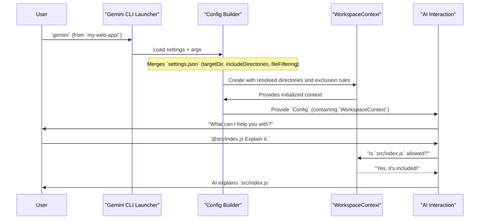

# Chapter 4: Workspace Context

In [Chapter 3: Configuration](03_configuration_.md), you learned how Gemini CLI builds its "master plan" (`Config` object) by combining all your preferences from various sources. This `Config` object dictates everything the CLI does, including what files and folders it should pay attention to.

Now, let's zoom in on a very practical aspect of this master plan: how Gemini CLI understands *your project*. Imagine you have a vast computer with thousands of files. When you're asking an AI about your code, it needs to know, "Which code? From where?" Without clear instructions, it could get confused, look at the wrong files, or miss important context.

This is where **Workspace Context** comes in! It's like putting a thoughtful fence around your work area, telling the AI exactly which folders and files belong to your current project. It helps the AI focus its attention on your specific task, without getting distracted by unrelated documents or old projects on your computer.

### Why Does the AI Need a Workspace Context?

Think of Gemini CLI as an incredibly smart assistant working on your desk.
*   If your desk is messy with papers from many different projects, the assistant might struggle to find the right documents for your current task.
*   If your desk is organized, and you've clearly laid out only the relevant papers for the task at hand, the assistant can work much more efficiently and accurately.

**Workspace Context** is how you "organize the desk" for your AI assistant. It ensures that when the AI thinks about your project, reads files using `@` commands, or generates code, it's always working within the boundaries you've defined. This leads to more accurate responses and a much better experience.

### Key Concepts of Workspace Context

Workspace Context isn't just one folder; it's a combination of rules that define your project's scope:

1.  **Project Root (Working Directory):** This is the main folder where you launched Gemini CLI. It's usually the top-level directory of your project. This is always included by default.
2.  **Included Directories:** Sometimes, your project files might be spread across several folders that aren't all nested under one single "root." You can explicitly tell Gemini CLI to include these additional folders in its context.
3.  **Excluded Files and Folders:** Just as important as including is *excluding*. You don't want the AI looking inside temporary build folders (`dist/`), dependency folders (`node_modules/`), or version control data (`.git/`). Gemini CLI can use standard exclusion files like `.gitignore` and its own `.geminiignore` to skip these.

These concepts combine to form the specific "world" that the AI will consider when interacting with your project.

### Use Case: Guiding the AI in a Project

Let's imagine you have a web development project with the following structure:

```
my-web-app/
├── src/               # Your main source code (JavaScript, HTML, CSS)
│   ├── index.js
│   └── styles.css
├── docs/              # Project documentation
│   └── README.md
├── node_modules/      # Installed dependencies (you don't want AI to read these!)
├── .git/              # Git version control data (also ignore)
└── .gemini/           # Your Gemini CLI project settings live here
    └── settings.json
```

You want Gemini CLI to:
1.  Automatically include your `src/` and `docs/` folders.
2.  Automatically ignore the `node_modules/` and `.git/` folders.

#### 1. Defining Your Workspace Context in `settings.json`

You can define your project's workspace context using your project-specific `settings.json` file (located at `my-web-app/.gemini/settings.json`).

Here’s how you would configure it:

```json
// my-web-app/.gemini/settings.json
{
  "includeDirectories": [
    "src",
    "docs"
  ],
  "fileFiltering": {
    "respectGitIgnore": true,
    "respectGeminiIgnore": true
  }
}
```

**What this does:**
*   `"includeDirectories": ["src", "docs"]`: This tells Gemini CLI to actively consider the `src/` and `docs/` folders (relative to your project root `my-web-app/`) as part of the project's context.
*   `"fileFiltering": { ... }`: This section controls which files and folders to *exclude*.
    *   `"respectGitIgnore": true`: Gemini CLI will read your project's `.gitignore` file and automatically exclude anything listed there (which usually includes `node_modules/`, `build/`, `.env`, etc.).
    *   `"respectGeminiIgnore": true`: Similarly, if you have a `.geminiignore` file, those patterns will also be applied.

#### 2. Interacting with the AI Using Your Defined Context

Once you've configured your `settings.json` and launched Gemini CLI from the `my-web-app/` directory, the AI will operate with this context.

*   **Asking about a specific file:**

    ```
    @src/index.js Explain this JavaScript file.
    ```

    **What happens:** Gemini CLI knows `src/` is an included directory and can easily find and provide the content of `index.js` to the AI.

*   **Asking for an overview:**

    ```
    Summarize the main purpose of this project, focusing on the code and documentation.
    ```

    **What happens:** The AI can intelligently search and understand files within `src/` and `docs/`, while completely ignoring the noise from `node_modules/` or `.git/`, because these were defined in your Workspace Context. This makes the AI's answer much more relevant.

### Under the Hood: How Workspace Context is Managed

When Gemini CLI starts, the "master plan" (`Config` object) comes together, as you learned in [Chapter 3: Configuration](03_configuration_.md). Part of this plan involves setting up the Workspace Context.

#### Step-by-Step Walkthrough

1.  **CLI Starts:** You launch `gemini-cli` from your `my-web-app/` directory.
2.  **Config Builds:** The `Config` object is assembled, merging all settings. It reads `my-web-app/.gemini/settings.json`, getting values for `targetDir` (which will be `my-web-app/`), `includeDirectories` (`src`, `docs`), and `fileFiltering` (`respectGitIgnore: true`).
3.  **WorkspaceContext Creation:** The `Config` uses these values to create a special object called `WorkspaceContext`. This `WorkspaceContext` is responsible for keeping track of all the allowed and disallowed paths.
4.  **Path Resolution:** The `WorkspaceContext` takes your `targetDir` and `includeDirectories` and converts them into absolute, verified paths on your computer. It also loads `.gitignore` and `.geminiignore` patterns into a `FileExclusions` service.
5.  **AI Interacts:** Whenever the AI needs to access files (e.g., when you use an `@` command, or when it uses a tool like `ReadFileTool`), it first consults the `WorkspaceContext` and `FileExclusions` service.
    *   "Is this file within one of the included directories?"
    *   "Is this file excluded by a `.gitignore` or `.geminiignore` rule?"
6.  **Focused Operation:** Only if a file is *within* the allowed directories and *not excluded* will it be considered by the AI, ensuring the AI remains focused on your defined project space.

Here's a simplified diagram of this process:



#### Inside the Code (Simplified)

The `Config` object (from `packages/core/src/config/config.ts`) is where the `WorkspaceContext` is created and stored.

First, within the `Config` constructor, the `WorkspaceContext` is initialized:

```typescript
// In packages/core/src/config/config.ts (Simplified)

import { WorkspaceContext } from '../utils/workspaceContext.js'; // Import the WorkspaceContext class
// ... other imports

export class Config {
  // ... other properties
  private workspaceContext: WorkspaceContext; // Declaration of the workspace context
  // ...

  constructor(params: ConfigParameters) {
    // ... other initializations
    this.targetDir = path.resolve(params.targetDir);
    // Initialize WorkspaceContext using the target directory and any included directories
    this.workspaceContext = new WorkspaceContext(
      this.targetDir,
      params.includeDirectories ?? [], // Pass included directories from config parameters
    );
    // ...
    this.fileExclusions = new FileExclusions(this); // Initializes file exclusions (e.g., .gitignore)
    // ...
  }

  getWorkspaceContext(): WorkspaceContext {
    return this.workspaceContext; // Method to get the initialized context
  }

  getFileExclusions(): FileExclusions {
    return this.fileExclusions;
  }
  // ...
}
```
This snippet shows that when a `Config` object is created, it immediately sets up a `WorkspaceContext` using the `targetDir` (your project root) and any `includeDirectories` you specified in your settings. It also sets up `FileExclusions` based on your `fileFiltering` settings.

The `WorkspaceContext` class itself (`packages/core/src/utils/workspaceContext.ts`) handles the actual logic of managing and validating directories:

```typescript
// In packages/core/src/utils/workspaceContext.ts (Simplified)

import * as fs from 'node:fs';
import * as path from 'node:path';
import * as process from 'node:process';

export class WorkspaceContext {
  private directories = new Set<string>(); // Stores all absolute paths of included directories
  // ... other properties and methods

  constructor(directory: string, additionalDirectories: string[] = []) {
    this.addDirectory(directory); // Add the initial project root
    for (const additionalDirectory of additionalDirectories) {
      this.addDirectory(additionalDirectory); // Add any extra directories
    }
    // ...
  }

  addDirectory(directory: string, basePath: string = process.cwd()): void {
    try {
      const resolved = this.resolveAndValidateDir(directory, basePath);
      this.directories.add(resolved); // Add only valid, resolved paths
      // ... notify listeners if directories changed
    } catch (err) {
      console.warn(`[WARN] Skipping unreadable directory: ${directory}`);
    }
  }

  isPathWithinWorkspace(pathToCheck: string): boolean {
    try {
      const fullyResolvedPath = this.fullyResolvedPath(pathToCheck);
      for (const dir of this.directories) {
        if (this.isPathWithinRoot(fullyResolvedPath, dir)) {
          return true; // Check if the path is inside any of the included directories
        }
      }
      return false;
    } catch (_error) {
      return false;
    }
  }

  private resolveAndValidateDir(directory: string, basePath: string): string {
    const absolutePath = path.isAbsolute(directory)
      ? directory
      : path.resolve(basePath, directory);
    // ... checks if directory exists and is actually a directory
    return fs.realpathSync(absolutePath); // Returns the canonical absolute path
  }
}
```
This simplified `WorkspaceContext` code shows how it manages a set of absolute directory paths. When you ask if a `pathToCheck` is part of the workspace (e.g., when using `@my_file.js`), it efficiently checks if that path falls within any of its managed directories. The `FileExclusions` service, not shown in detail here but used in conjunction, then filters out paths that match `.gitignore` or `.geminiignore` rules.

### Conclusion

You've now mastered **Workspace Context**! You understand that it's Gemini CLI's way of defining the boundaries of your project, telling the AI exactly where to focus its attention. By configuring your project root, explicitly including relevant directories, and using `.gitignore` (or `.geminiignore`) for exclusions, you ensure the AI operates within a clear, relevant, and efficient environment. This focused approach is critical for the AI to provide accurate and useful help.

With a solid understanding of how Gemini CLI sets up its environment, you're ready to dive into the core reason we use Gemini CLI: **AI Interaction** itself!

[Next Chapter: AI Interaction](05_ai_interaction_.md)

---

<sub><sup>Generated by [AI Codebase Knowledge Builder](https://github.com/The-Pocket/Tutorial-Codebase-Knowledge).</sup></sub> <sub><sup>**References**: [[1]](https://github.com/google-gemini/gemini-cli/blob/d37fff7fd60fd1e9b69f487d5f23b1121792d331/packages/core/src/config/config.ts), [[2]](https://github.com/google-gemini/gemini-cli/blob/d37fff7fd60fd1e9b69f487d5f23b1121792d331/packages/core/src/utils/workspaceContext.ts)</sup></sub>