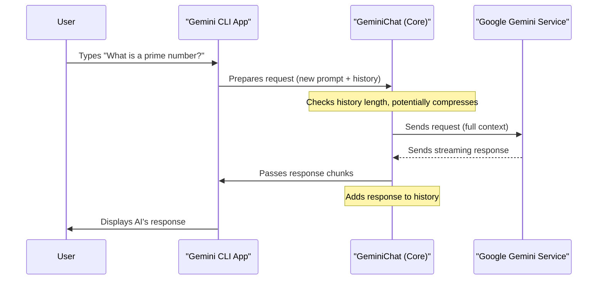

# Chapter 5: AI Interaction

In [Chapter 4: Workspace Context](04_workspace_context_.md), you learned how Gemini CLI establishes a clear boundary around your project, telling the AI exactly which files and folders are relevant. Now that the stage is set, it's time to talk about the main event: **AI Interaction**!

This is the very heart of Gemini CLI – the direct connection to the powerful Gemini AI model. Think of it as your personal translator and messenger service. You tell Gemini CLI what you want, it translates your request into something the AI understands, sends it off to Google's Gemini service, and then brings the AI's intelligent response right back to you.

But it's not just a simple send-and-receive. Gemini CLI also acts as a diligent secretary, managing the conversation's memory. This means the AI remembers what you've discussed before, making your interactions feel continuous, smart, and much more helpful than starting fresh every time.

### Why Do We Need AI Interaction Management?

Imagine having a conversation with someone who forgets everything you said a minute ago. That wouldn't be very productive! The same goes for AI. For Gemini CLI to be truly useful, it needs to:

*   **Understand Your Requests:** Take your natural language input and prepare it for the AI.
*   **Talk to the AI:** Send your requests to Google's powerful Gemini service.
*   **Understand AI Responses:** Take the AI's technical response and present it clearly to you.
*   **Remember the Chat:** Keep a complete record of the conversation so the AI can build on previous turns, much like a human conversation. This "memory" is what makes the AI feel like a true assistant, not just a one-off answer machine.

### Key Concepts of AI Interaction

Let's break down the main ideas that make continuous AI interaction possible in Gemini CLI:

1.  **The "Messenger" (GeminiClient/GeminiChat):** These are the core components that handle sending your messages and receiving AI responses. They're like the postal service for your AI conversations.
2.  **Conversation History (`Content`):** Every message, both yours and the AI's, is stored as a piece of "content." These pieces are collected in order to form the entire conversation history.
3.  **The AI's "Brain" (Gemini Model):** This is the actual AI service provided by Google that processes your requests and generates responses. Gemini CLI picks the right model based on your [Chapter 3: Configuration](03_configuration_.md) settings.
4.  **Memory Management (Compression):** As conversations grow, they can become very long. Gemini CLI intelligently summarizes older parts of the conversation to keep the memory footprint small, ensuring the AI remains efficient without losing the most important context.

### Use Case: Having a Continuous Conversation

Let's use Gemini CLI to ask about a Python function and then follow up with more questions, expecting the AI to remember our previous turn.

#### 1. Starting a Conversation

You open Gemini CLI and type your first prompt:

```
> Can you write a Python function to check if a number is prime?
```

**What happens:**
*   Gemini CLI sends your question to the AI.
*   The AI processes it and sends back a Python function.
*   Gemini CLI displays the function.

```python
# Expected AI Response (simplified)
```python
def is_prime(num):
    if num < 2:
        return False
    for i in range(2, int(num**0.5) + 1):
        if num % i == 0:
            return False
    return True
```
This is a good start, but now you want to refine it.

#### 2. Following Up (AI Remembers!)

You want to make a small change based on the previous response:

```
> Add a docstring to explain what the function does.
```

**What happens:**
*   Crucially, Gemini CLI doesn't just send "Add a docstring to explain what the function does."
*   Instead, it sends *your new request* along with *the entire previous conversation history* (your first question and the AI's response) to the AI.
*   The AI, because it "remembers," understands you're talking about the `is_prime` function it just provided.
*   It generates a new version of the function, now with a docstring.

```python
# Expected AI Response (simplified)
```python
def is_prime(num):
    """
    Checks if a given number is a prime number.
    A prime number is a natural number greater than 1 that has no positive
    divisors other than 1 and itself.
    """
    if num < 2:
        return False
    for i in range(2, int(num**0.5) + 1):
        if num % i == 0:
            return False
    return True
```

This seamless continuation is the magic of AI Interaction with conversation memory.

### Under the Hood: The Conversation Flow

When you type a prompt, a lot happens very quickly to ensure a continuous conversation.

#### Step-by-Step Walkthrough

1.  **User Types Prompt:** You type your question into Gemini CLI.
2.  **CLI Prepares Request:** Gemini CLI takes your new prompt. It also gathers the entire conversation history so far. If you used an `@` command (from [Chapter 1: CLI Commands](01_cli_commands_.md)), it fetches the file content and adds it to the prompt.
3.  **History Management (Compression):** If the conversation has gotten very long, Gemini CLI might decide to "compress" the older parts of the history. It summarizes early turns to keep the total amount of text sent to the AI within reasonable limits, saving tokens and improving speed. This is done to ensure the AI can still grasp the context without being overwhelmed.
4.  **Send to AI:** The combined prompt and (potentially compressed) history are packaged and sent to the Google Gemini service. This is handled by a part of the CLI called `GeminiChat`.
5.  **AI Processes:** The Gemini AI model analyzes the complete context and generates a response.
6.  **Receive Response (Streaming):** Gemini CLI receives the AI's response, often in "chunks" (like a real-time stream of text).
7.  **Update History:** As the AI's response comes in, Gemini CLI adds it to the ongoing conversation history, ready for the next turn.
8.  **Display to User:** The AI's response is displayed in your terminal.

Here's a simplified diagram of this process:



#### Inside the Code (Simplified)

The core components managing this interaction are `GeminiClient` (in `packages/core/src/core/client.ts`) and `GeminiChat` (in `packages/core/src/core/geminiChat.ts`). `GeminiClient` acts as the overall orchestrator, but `GeminiChat` is where the direct conversation history and interaction with the AI model happen.

1.  **Initializing the Chat:** When Gemini CLI starts or you clear a conversation, a new `GeminiChat` instance is created. It's initialized with system instructions and any initial conversation history.

    ```typescript
    // In packages/core/src/core/client.ts (Simplified)

    import { GeminiChat } from './geminiChat.js';
    import type { Config } from '../config/config.js';

    export class GeminiClient {
      private chat?: GeminiChat; // Holds the active chat session

      constructor(private readonly config: Config) {
        // ...
      }

      async initialize() {
        // When the client initializes, it starts a new chat
        this.chat = await this.startChat();
      }

      async startChat(extraHistory?: Content[]): Promise<GeminiChat> {
        // ... logic to prepare system instructions and initial history
        const systemInstruction = "You are a helpful coding assistant.";
        const initialHistory = [ /* ... from env context ... */ ];

        // Creates a new GeminiChat instance
        return new GeminiChat(
          this.config,
          { systemInstruction },
          initialHistory,
        );
      }
      // ... other methods
    }
    ```
    The `GeminiClient`'s `startChat` method is responsible for setting up a fresh `GeminiChat` object, which will manage the actual back-and-forth.

2.  **Sending Messages and Managing History:** The `GeminiChat` class has methods to add your messages to the history (`addHistory`), retrieve the current history (`getHistory`), and, most importantly, send messages to the AI and receive responses (`sendMessageStream`).

    ```typescript
    // In packages/core/src/core/geminiChat.ts (Simplified)

    import type { Content, GenerateContentResponse, Part } from '@google/genai';
    import type { Config } from '../config/config.js';

    export class GeminiChat {
      private history: Content[] = []; // This array stores the entire conversation
      // ... other properties

      constructor(config: Config, generationConfig: any, initialHistory: Content[]) {
        this.history = initialHistory; // Load initial messages
        // ...
      }

      addHistory(content: Content): void {
        this.history.push(content); // Add a new message (user or model) to the end
      }

      getHistory(curated: boolean = false): Content[] {
        // Returns a copy of the conversation history.
        // 'curated' means it might filter out some internal AI thoughts.
        return structuredClone(this.history);
      }

      async sendMessageStream(
        model: string,
        params: { message: Part | Part[] },
        prompt_id: string,
      ): Promise<AsyncGenerator<any>> { // Returns a stream of AI response chunks
        const userContent = { role: 'user', parts: params.message };
        this.addHistory(userContent); // Add YOUR message to history first

        const requestContents = this.getHistory(true); // Get ALL messages for AI

        // Simulate sending to AI and receiving stream
        // (Actual implementation uses this.config.getContentGenerator().generateContentStream)
        const dummyAIStream = async function* () {
            // ... API call logic to Google Gemini ...
            yield { /* AI response chunk 1 */ };
            yield { /* AI response chunk 2 */ };
            // ...
        }();

        const modelResponseParts: Part[] = [];
        for await (const chunk of dummyAIStream) {
            // Process each chunk from the AI
            // ... (extract parts, handle thoughts)
            if (chunk.candidates?.[0]?.content?.parts) {
                modelResponseParts.push(...chunk.candidates[0].content.parts);
            }
            yield chunk; // Pass the chunk to the UI
        }

        // After the stream finishes, add the complete AI response to history
        this.addHistory({ role: 'model', parts: modelResponseParts });
        // ...
      }
    }
    ```
    This simplified `GeminiChat` code shows the crucial `history` array. When `sendMessageStream` is called, it first adds the user's message to `history`. Then, it sends the *entire* `history` (or a curated version) to the AI. As the AI streams back its response, each chunk is yielded to the UI, and the complete response is added to `history` at the end, maintaining the conversation memory.

3.  **Compression (Memory Management):** The `GeminiClient` also handles `tryCompressChat` (in `packages/core/src/core/client.ts`), which is a sophisticated mechanism to keep the conversation history from getting too large. When the number of tokens (pieces of words) in the history exceeds a certain threshold, older parts of the conversation are summarized by the AI itself, keeping the most recent and relevant parts intact. This ensures efficient use of the AI model's capacity.

    ```typescript
    // In packages/core/src/core/client.ts (Simplified)

    export class GeminiClient {
      // ...
      async tryCompressChat(prompt_id: string, force: boolean = false): Promise<any> {
        // ... checks token count of current history ...
        // if (tokenCount > COMPRESSION_TOKEN_THRESHOLD * tokenLimit(model)) {
        //   // Identifies older history to summarize
        //   const historyToCompress = this.getChat().getHistory().slice(0, splitPoint);
        //   // Sends historyToCompress to AI to create a summary
        //   const summaryResponse = await this.config.getContentGenerator().generateContent({
        //     contents: historyToCompress,
        //     config: { systemInstruction: "Summarize this conversation." },
        //   });
        //   const summary = getResponseText(summaryResponse);
        //   // Replaces old history with summary + newer history
        //   this.chat = await this.startChat([ /* ... summary and new history ... */ ]);
        // }
        // ...
      }
      // ...
    }
    ```
    The `tryCompressChat` method orchestrates the compression. If the conversation history gets too long, it takes the older parts, asks the AI to summarize them into a shorter text, and then uses that summary along with the newer parts to rebuild the conversation history. This effectively "shrinks" the memory without losing core context.

### Conclusion

You've successfully delved into the world of **AI Interaction**! You now understand that Gemini CLI acts as your sophisticated messenger, managing conversation history, facilitating continuous dialogue, and even intelligently compressing older turns to keep the AI focused and efficient. This direct line to the AI, coupled with its persistent memory, is what makes Gemini CLI such a powerful assistant.

Next, we'll explore how the AI can go beyond just text and actually *perform actions* using **Tool Management**!

[Next Chapter: Tool Management](06_tool_management_.md)

---

<sub><sup>Generated by [AI Codebase Knowledge Builder](https://github.com/The-Pocket/Tutorial-Codebase-Knowledge).</sup></sub> <sub><sup>**References**: [[1]](https://github.com/google-gemini/gemini-cli/blob/d37fff7fd60fd1e9b69f487d5f23b1121792d331/packages/cli/src/gemini.tsx), [[2]](https://github.com/google-gemini/gemini-cli/blob/d37fff7fd60fd1e9b69f487d5f23b1121792d331/packages/core/src/core/client.ts), [[3]](https://github.com/google-gemini/gemini-cli/blob/d37fff7fd60fd1e9b69f487d5f23b1121792d331/packages/core/src/core/geminiChat.ts)</sup></sub>