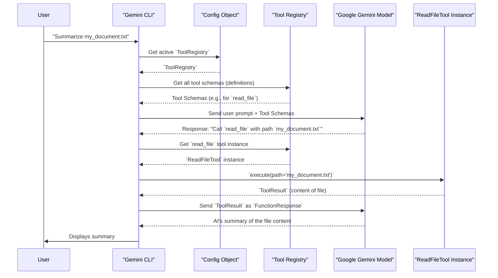

# Chapter 6: Tool Management

In [Chapter 5: AI Interaction](05_ai_interaction_.md), you saw how Gemini CLI helps you have continuous conversations with the AI, making it remember past messages. But what if the AI needs to *do* something in the real world, not just talk? What if you ask it to "read a file" or "search the web"? That's where **Tool Management** comes into play!

Think of this as the AI's special "toolbox." It keeps track of all the unique abilities (like reading files, running commands, or searching the internet) that the Gemini AI can use to help you. When the AI needs to perform an action, it looks in this toolbox, finds the right tool, and then uses it to get the job done. This lets the AI go beyond just generating text and actually interact with your computer or the internet!

### Why Does the AI Need Tools?

Imagine you have a super smart friend who can answer any question you ask, but they can't actually *do* anything themselves – they can't pick up a book, use a calculator, or search for information online. That friend would be helpful, but limited.

For Gemini CLI to be a truly powerful assistant, it needs to:

*   **Interact with your files:** Read your code, write a new script, or list files in a directory.
*   **Run commands:** Execute a shell command on your computer to check its status or build something.
*   **Access the internet:** Fetch information from a website or perform a web search.
*   **Take actions:** Make changes, not just suggest them.

Tools provide these "hands and eyes" for the AI, allowing it to perform concrete actions in response to your requests.

### Key Concepts of Tool Management

Let's look at the main ideas that make the AI's toolbox work:

1.  **What is a "Tool"?**
    *   A "tool" is a specific function or ability that the AI can call. Each tool has a clear purpose.
    *   **Example:** `read_file` is a tool to read content from a file. `run_shell_command` is a tool to execute a command on your computer.
    *   Each tool also has a `description` that explains what it does, and a `parameterSchema` (like a list of ingredients) that tells the AI exactly what information it needs to use the tool (e.g., for `read_file`, it needs the `path` to the file).

2.  **The `ToolRegistry` (The Toolbox Organizer)**
    *   This is a central list that holds *all* the tools the Gemini CLI knows about.
    *   It's like a library catalog: it knows the name of every tool, what it does, and how to use it.
    *   When the AI wants to use a tool, it consults the `ToolRegistry` to get the correct instructions.

3.  **The `BaseTool` (The Blueprint for Tools)**
    *   Every tool, whether built-in or custom, follows a common blueprint called `BaseTool` (or a similar base class).
    *   This blueprint ensures that all tools have a `name`, a `description`, a `parameterSchema`, and an `execute()` method that defines what the tool *does* when called.

4.  **`ToolResult` (What a Tool Gives Back)**
    *   When a tool finishes its job (its `execute()` method runs), it returns a `ToolResult`.
    *   This result usually includes:
        *   `llmContent`: The actual data or information that the AI needs to understand (e.g., the content of the file that was read).
        *   `returnDisplay`: A user-friendly message or output to show *you* in the terminal (e.g., "Successfully read `my_document.txt`").

### Use Case: Asking the AI to Summarize a File

Let's say you have a file called `important_notes.txt` in your project, and you want Gemini to summarize its content for you.

```
> Summarize the key points from the file 'important_notes.txt'.
```

Here's how **Tool Management** helps the AI accomplish this:

#### 1. The AI Identifies a Need for a Tool

You ask the AI to summarize a file. The AI doesn't have the ability to magically "know" what's inside files. It understands that "summarize a file" implies "first, I need to *read* the file."

#### 2. The AI Consults its Toolbox

The AI looks at the list of tools it has access to (provided by the `ToolRegistry`). It finds a tool named `read_file` which has a description like "Reads the content of a file." This is exactly what it needs! The `parameterSchema` for `read_file` tells the AI it needs a `path` to the file.

#### 3. The AI "Calls" the Tool

The AI then sends a message back to Gemini CLI, saying, "I want to call the `read_file` tool, and the `path` parameter should be `important_notes.txt`."

#### 4. Gemini CLI Executes the Tool

Gemini CLI receives this instruction. It finds the `ReadFileTool` in its `ToolRegistry` and then tells that tool to `execute()` with `important_notes.txt` as the path. The `ReadFileTool` then opens your `important_notes.txt` file and reads its content.

#### 5. The Tool Returns a Result

The `ReadFileTool` finishes, and returns a `ToolResult`. This result contains the actual text content of `important_notes.txt` as `llmContent`, and perhaps a small message for you in `returnDisplay`.

#### 6. The AI Uses the Tool's Output

Gemini CLI sends the `llmContent` (the file's text) back to the Gemini AI. Now, the AI has the actual text of your file! With this content, the AI can perform the summary you initially asked for.

#### 7. The AI Responds to You

Finally, the AI sends its summary of the file back to Gemini CLI, which then displays it to you.

You can see how tools bridge the gap between the AI's intelligence and the real-world actions it needs to perform to be truly helpful.

### Under the Hood: The Tool Execution Dance

When the AI decides to use a tool, it triggers a sophisticated sequence of events within Gemini CLI.

#### Step-by-Step Walkthrough

1.  **User Asks for Action**: You type a prompt like "Summarize `my_document.txt`."
2.  **CLI Prepares Prompt with Tool Schemas**: Gemini CLI doesn't just send your question. It also gives the AI a list of all the tools it *can* use, along with their detailed descriptions and how to call them (their `parameterSchema`).
3.  **AI Decides to Use a Tool**: The Google Gemini model receives your prompt and the list of tools. It understands that to summarize a file, it needs to read it first. So, it decides to "call" the `read_file` tool.
4.  **AI Requests Tool Execution**: The Gemini model's response isn't directly a summary. Instead, it's a special message saying, "Execute `read_file` with the parameter `path='my_document.txt'`."
5.  **CLI Retrieves and Validates Tool**: Gemini CLI receives this special message. It then asks the `ToolRegistry` for the actual `ReadFileTool` object. It also quickly checks if the parameters provided by the AI are valid (e.g., is `my_document.txt` a real path?).
6.  **Tool Execution**: Gemini CLI then tells the `ReadFileTool` to `execute()` its action. The `ReadFileTool` reads the file.
7.  **Tool Returns Result**: The `ReadFileTool` finishes and returns a `ToolResult`, which contains the file's content (for the AI) and a display message (for you).
8.  **CLI Sends Tool Output Back to AI**: Gemini CLI takes the `llmContent` from the `ToolResult` and sends it back to the Google Gemini model. This is like telling the AI, "Here's what happened when you used the tool."
9.  **AI Formulates Final Response**: Now, with the actual file content, the Gemini model can process it and generate the summary you asked for.
10. **CLI Displays Result**: Gemini CLI shows you any display messages from the tool execution and then the final summary from the AI.

Here's a simplified diagram of this process:



#### Inside the Code (Simplified)

The core `Config` object, which you learned about in [Chapter 3: Configuration](03_configuration_.md), is responsible for setting up the `ToolRegistry`.

1.  **Initializing the `ToolRegistry`**: When Gemini CLI starts, the `Config` object calls `createToolRegistry()` to build up its collection of tools. This involves registering built-in tools (like `ReadFileTool`, `ShellTool`) and potentially discovering custom tools from your project.

    ```typescript
    // In packages/core/src/config/config.ts (Simplified)
    import { ToolRegistry } from '../tools/tool-registry.js';
    import { ReadFileTool } from '../tools/read-file.js'; // A built-in tool

    export class Config {
      private toolRegistry!: ToolRegistry;
      // ... other properties

      async initialize(): Promise<void> {
        // ... other initializations
        this.toolRegistry = await this.createToolRegistry();
        // ...
      }

      async createToolRegistry(): Promise<ToolRegistry> {
        const registry = new ToolRegistry(this);

        // Helper to register core tools that are enabled
        const registerCoreTool = (ToolClass: any, ...args: unknown[]) => {
          // Simplified: In real code, checks if tool is enabled/disabled
          registry.registerTool(new ToolClass(...args));
        };

        registerCoreTool(ReadFileTool, this); // Register our ReadFileTool
        // ... register other built-in tools like LSTool, ShellTool, etc.

        await registry.discoverAllTools(); // Also discovers custom tools
        return registry;
      }
      // ...
    }
    ```
    This `Config` snippet shows how it orchestrates the creation of the `ToolRegistry` and registers fundamental tools like `ReadFileTool`.

2.  **The `ToolRegistry` Class**: The `ToolRegistry` itself is like a big map that stores all the tools. It has methods to `registerTool` (add a new tool), `getFunctionDeclarations` (give the AI the tool's descriptions), and `getTool` (find a specific tool when the AI asks for it).

    ```typescript
    // In packages/core/src/tools/tool-registry.ts (Simplified)
    import type { FunctionDeclaration } from '@google/genai';
    import type { AnyDeclarativeTool } from './tools.js'; // Our tool blueprint

    export class ToolRegistry {
      private tools: Map<string, AnyDeclarativeTool> = new Map();
      // ... other properties

      constructor(config: Config) {
        // ...
      }

      registerTool(tool: AnyDeclarativeTool): void {
        this.tools.set(tool.name, tool); // Add tool to our map
      }

      getFunctionDeclarations(): FunctionDeclaration[] {
        const declarations: FunctionDeclaration[] = [];
        this.tools.forEach((tool) => {
          declarations.push(tool.schema); // Provide AI with tool's schema
        });
        return declarations;
      }

      getTool(name: string): AnyDeclarativeTool | undefined {
        return this.tools.get(name); // Find and return the tool instance
      }
      // ...
    }
    ```
    This shows how `ToolRegistry` uses a `Map` to hold tools, and provides methods for getting their `schemas` (the definitions the AI uses) and retrieving a tool by its `name`.

3.  **The `BaseDeclarativeTool` (Tool Blueprint)**: All tools inherit from a `BaseDeclarativeTool` (or similar `BaseTool` concept). This ensures they all have a `name`, `description`, `parameterSchema`, and an `execute` method that does the actual work.

    ```typescript
    // In packages/core/src/tools/tools.ts (Simplified concept)
    import type { Part, FunctionDeclaration } from '@google/genai';

    interface ToolResult {
      llmContent: string | Part[]; // What to send back to the AI
      returnDisplay?: string;      // What to show the user
    }

    // This is a simplified interface for a tool blueprint
    export interface AnyDeclarativeTool {
      name: string;
      displayName: string;
      description: string;
      parameterSchema: Record<string, unknown>; // Rules for parameters
      schema: FunctionDeclaration;              // Full definition for the AI
      
      // The method that actually performs the tool's action
      execute(
        params: Record<string, unknown>,
        signal?: AbortSignal,
      ): Promise<ToolResult>;
      // ... other methods like shouldConfirmExecute, validateToolParams
    }
    ```
    This conceptual `AnyDeclarativeTool` interface highlights the essential parts of a tool: its identifying information (`name`, `description`), its structure for the AI (`parameterSchema`, `schema`), and its actual behavior (`execute`). When the `execute` method runs, it returns a `ToolResult` with the information for both the AI and the user.

### Conclusion

You've now explored **Tool Management** in Gemini CLI! You understand that tools are the AI's special abilities, allowing it to perform actions beyond just generating text. By configuring and registering these tools in the `ToolRegistry`, Gemini CLI empowers the AI to interact with your environment, read files, run commands, and much more, making it an incredibly versatile assistant. This capability for the AI to take action leads directly into our next topic: the **AI Agent Loop**, where the AI can combine these tools into complex sequences to solve bigger problems!

[Next Chapter: AI Agent Loop](07_ai_agent_loop_.md)

---

<sub><sup>Generated by [AI Codebase Knowledge Builder](https://github.com/The-Pocket/Tutorial-Codebase-Knowledge).</sup></sub> <sub><sup>**References**: [[1]](https://github.com/google-gemini/gemini-cli/blob/d37fff7fd60fd1e9b69f487d5f23b1121792d331/docs/core/tools-api.md), [[2]](https://github.com/google-gemini/gemini-cli/blob/d37fff7fd60fd1e9b69f487d5f23b1121792d331/docs/tools/index.md), [[3]](https://github.com/google-gemini/gemini-cli/blob/d37fff7fd60fd1e9b69f487d5f23b1121792d331/packages/core/src/config/config.ts), [[4]](https://github.com/google-gemini/gemini-cli/blob/d37fff7fd60fd1e9b69f487d5f23b1121792d331/packages/core/src/tools/tool-registry.ts)</sup></sub>