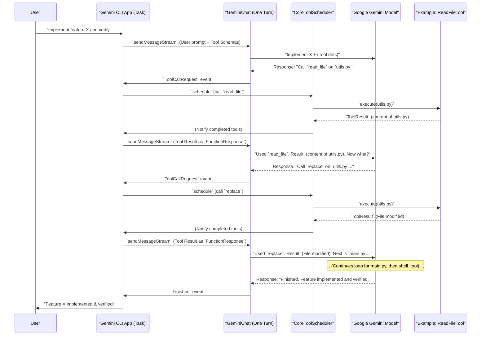

# Chapter 7: AI Agent Loop

In [Chapter 6: Tool Management](06_tool_management_.md), you learned how Gemini CLI gives the AI powerful "tools" to perform actions in the real world, like reading files or running commands. But what if a task is too complex for just one tool use? What if the AI needs to think, use a tool, see the result, think again, maybe use another tool, and keep going until it solves a bigger problem?

This entire process of the AI *thinking, acting, and observing the results in a continuous cycle* to achieve a multi-step goal is called the **AI Agent Loop**. It's the AI's internal thought process, managing each step of its interaction with you, making it feel like a sophisticated conductor orchestrating complex multi-step reasoning.

### Why Do We Need an AI Agent Loop?

Imagine asking an assistant to "fix the bug in my Python script." This isn't a single step! A human assistant would:
1.  **Read** the script to understand it.
2.  **Analyze** the bug (maybe run tests).
3.  **Propose** a fix.
4.  **Apply** the fix.
5.  **Verify** the fix (run tests again).
6.  **Report** back to you.

The AI Agent Loop allows Gemini CLI's AI to follow a similar multi-step, intelligent process. It lets the AI tackle complex requests by breaking them down into smaller, manageable actions, learning from the results of each action, and progressively working towards your overall goal.

### Key Concepts of the AI Agent Loop

The AI Agent Loop is essentially a cycle of "Observe -> Think -> Act" that repeats until a goal is met or human input is needed.

1.  **Observation:**
    *   This is the information the AI receives. It can be your initial prompt, the results from a tool it just used (like the content of a file it read), or feedback from you.
2.  **Thought/Reasoning (Think):**
    *   After observing, the AI "thinks" about the situation. It processes the new information, updates its understanding of the goal, and decides what the next logical step should be. This might involve planning several steps ahead or revising its plan.
3.  **Action (Act):**
    *   Based on its thoughts, the AI decides to take an action. This usually means selecting a tool (from its [Chapter 6: Tool Management](06_tool_management_.md) toolbox) and specifying the exact parameters needed for that tool.
4.  **Tool Execution:**
    *   Gemini CLI receives the AI's instruction to use a tool and executes it.
5.  **Result (New Observation):**
    *   The tool completes its task and returns a result. This result then becomes the *next observation* for the AI, feeding back into the loop.

This cycle continues until the AI determines it has successfully completed your request, or it needs more information or approval from you.

### Use Case: Implement a New Feature and Verify It

Let's say you want Gemini CLI to:
"Implement a new function `calculate_average` in `utils.py` that takes a list of numbers and returns their average. Then, add a call to this function in `main.py` and print the result."

This is a perfect example for the AI Agent Loop:

#### 1. Initial Prompt (Observation)

You type your request into Gemini CLI:

```
> Implement a new function `calculate_average` in `utils.py` that takes a list of numbers and returns their average. Then, add a call to this function in `main.py` and print the result.
```

#### 2. AI Thinks & Acts - Step 1: Read `utils.py`

*   **Think:** "To add a function to `utils.py`, I first need to see its current content."
*   **Act:** The AI internally decides to use the `read_file` tool for `utils.py`.

#### 3. CLI Executes `read_file`, Returns Result (New Observation)

*   Gemini CLI uses the `read_file` tool (from [Chapter 6: Tool Management](06_tool_management_.md)) to get the content of `utils.py`.
*   The content of `utils.py` is returned to the AI.

#### 4. AI Thinks & Acts - Step 2: Modify `utils.py`

*   **Think:** "Now I have `utils.py`'s content. I need to generate the `calculate_average` function and figure out how to insert it."
*   **Act:** The AI generates the new function code and decides to use a `replace` tool (or similar editing tool) to insert it into `utils.py`.

#### 5. CLI Executes `replace` Tool, Returns Result (New Observation)

*   Gemini CLI, potentially after asking for your approval (depending on your [Chapter 2: Settings Management](02_settings_management_.md) and [Chapter 3: Configuration](03_configuration_.md)), executes the `replace` tool to update `utils.py`.
*   The result (e.g., "File `utils.py` updated") is returned to the AI.

#### 6. AI Thinks & Acts - Step 3: Read `main.py`

*   **Think:** "Okay, `utils.py` is updated. Now I need to modify `main.py` to call the new function. First, I need to read `main.py`."
*   **Act:** The AI internally decides to use the `read_file` tool for `main.py`.

#### 7. CLI Executes `read_file`, Returns Result (New Observation)

*   Gemini CLI gets the content of `main.py` and returns it to the AI.

#### 8. AI Thinks & Acts - Step 4: Modify `main.py`

*   **Think:** "I have `main.py`'s content. I need to add code to import `calculate_average` and call it."
*   **Act:** The AI generates the code to modify `main.py` and uses the `replace` tool.

#### 9. CLI Executes `replace` Tool, Returns Result (New Observation)

*   Gemini CLI executes the `replace` tool to update `main.py`.
*   The result (e.g., "File `main.py` updated") is returned to the AI.

#### 10. AI Thinks & Acts - Step 5: Verify (Optional but powerful)

*   **Think:** "Both files are modified. Can I verify this? I should run `main.py`."
*   **Act:** The AI internally decides to use the `shell_tool` to run `python main.py`.

#### 11. CLI Executes `shell_tool`, Returns Result (New Observation)

*   Gemini CLI runs `python main.py` in a sandboxed environment (if configured).
*   The output (e.g., the calculated average printed to console) is returned to the AI.

#### 12. AI Thinks & Finishes

*   **Think:** "I have updated the files and successfully run the program, seeing the correct output. My task is complete."
*   **Act:** The AI determines it's done and sends a final, comprehensive response to you.

This step-by-step dance between the AI's internal reasoning and its use of tools is the **AI Agent Loop** in action!

### Under the Hood: Orchestrating the Loop

The core logic for managing this continuous loop in Gemini CLI (specifically within the `a2a-server` context) is handled by the `Task` object. The `Task` object orchestrates the interaction between the AI, the tool scheduler, and the conversation history, making sure the "Observe -> Think -> Act" cycle flows smoothly.

#### Step-by-Step Walkthrough

1.  **User Input:** You send your initial prompt to Gemini CLI.
2.  **`Task` Orchestrates First AI Turn:** The `Task` object takes your prompt and uses the `GeminiClient` (which wraps the underlying `Turn` logic for a single AI interaction) to send your prompt and the available [Tool Management](06_tool_management_.md) tool definitions to the `Google Gemini Model`.
3.  **AI Responds (Content or Tool Call):** The `Google Gemini Model` processes your request. It might send back a chunk of text (which is shown to you) or, if it decides to use a tool, it sends a special "Function Call" message.
4.  **`Task` Detects Tool Call:** If a "Function Call" is received, the `Task` object (via its `acceptAgentMessage` method) extracts the tool name and arguments.
5.  **`Task` Schedules Tools:** The `Task` then passes these tool requests to the `CoreToolScheduler`. The scheduler is responsible for actually running the tools.
6.  **Tool Execution & Result:** The `CoreToolScheduler` executes the requested tools (e.g., `ReadFileTool`). Once a tool finishes, its result (e.g., file content, command output) is given back to the `CoreToolScheduler`.
7.  **`Task` Gathers Tool Results:** The `CoreToolScheduler` notifies the `Task` that tools have completed. The `Task` collects these results.
8.  **`Task` Feeds Results Back to AI:** Crucially, the `Task` takes these tool results and sends them *back* to the `Google Gemini Model` as a special "Function Response" message. This allows the AI to "observe" the outcome of its actions.
9.  **AI Continues Loop or Finishes:** With the tool results now in its context, the `Google Gemini Model` can continue to "Think" about the next step. It might decide to call another tool, generate more text, or determine that the overall goal has been achieved and send a "Finished" signal.
10. **Loop Continues or Stops:** If the AI sends more tool calls or text, the cycle repeats from step 3. If it sends a "Finished" signal, the `Task` marks the user's request as complete.

Here's a simplified view of the loop:



#### Inside the Code (Simplified)

The `Task` class (from `packages/a2a-server/src/agent/task.ts`) is the main orchestrator of the agent loop. It wraps the `GeminiClient` (which in turn uses `Turn`) and the `CoreToolScheduler`.

1.  **Handling User Messages and Sending to LLM:** When you type a message, the `acceptUserMessage` method in `Task` is called. It prepares your message and uses `this.geminiClient.sendMessageStream` to send it to the AI.

    ```typescript
    // In packages/a2a-server/src/agent/task.ts (Simplified)
    import { GeminiClient } from '@google/gemini-cli-core';

    export class Task {
      geminiClient: GeminiClient;
      // ... constructor and other methods

      async *acceptUserMessage(
        requestContext: RequestContext,
        aborted: AbortSignal,
      ): AsyncGenerator<ServerGeminiStreamEvent> {
        const userMessage = requestContext.userMessage;
        const llmParts: PartUnion[] = [];
        // ... logic to handle tool confirmations from user (if any)
        for (const part of userMessage.parts) {
          if (part.kind === 'text') {
            llmParts.push({ text: part.text });
            hasContentForLlm = true;
          }
        }

        if (hasContentForLlm) {
          // This sends the user's message (and conversation history) to the LLM
          yield* this.geminiClient.sendMessageStream(
            llmParts, aborted, /*prompt_id*/ '',
          );
        }
        // ... (other logic if only tool confirmations were in message)
      }
    }
    ```
    The `acceptUserMessage` method is your entry point to the agent loop. It takes your input (`userMessage.parts`) and feeds it to the `geminiClient`. The `sendMessageStream` handles the actual interaction with the `Google Gemini Model`.

2.  **Processing AI Responses (Content or Tool Calls):** The `Task` class also has an `acceptAgentMessage` method that processes *all* events coming back from the AI (via the `GeminiClient` stream). This is where the AI's "Thought" and "Action" are observed.

    ```typescript
    // In packages/a2a-server/src/agent/task.ts (Simplified)
    import { GeminiEventType } from '@google/gemini-cli-core';
    import type { ServerGeminiStreamEvent, ToolCallRequestInfo } from '@google/gemini-cli-core';

    export class Task {
      // ... (properties like scheduler, pendingToolCalls)

      async acceptAgentMessage(event: ServerGeminiStreamEvent): Promise<void> {
        switch (event.type) {
          case GeminiEventType.Content:
            // The AI generated text, display it to the user
            this._sendTextContent(event.value);
            break;
          case GeminiEventType.ToolCallRequest:
            // The AI wants to use a tool! Collect it.
            this.pendingToolCalls.push(event.value as ToolCallRequestInfo);
            // In the real code, these are collected and scheduled in batch
            // scheduleToolCalls(this.pendingToolCalls, abortSignal);
            break;
          case GeminiEventType.Thought:
            // The AI is sharing its internal thought process
            this._sendThought(event.value);
            break;
          case GeminiEventType.Finished:
            // The AI has completed its task
            logger.info(`[Task ${this.id}] Agent finished its turn.`);
            break;
          // ... (other event types like Error, UserCancelled)
        }
      }
    }
    ```
    This `acceptAgentMessage` method is the core of the `Observe` phase. It dispatches different events: `Content` is directly shown to you, `Thought` gives you insight into the AI's reasoning, and `ToolCallRequest` triggers the `Act` phase by queuing up tool executions.

3.  **Scheduling and Executing Tools:** When `ToolCallRequest` events come in, the `Task` aggregates them and then calls `this.scheduler.schedule`.

    ```typescript
    // In packages/a2a-server/src/agent/task.ts (Simplified)
    import { CoreToolScheduler } from '@google/gemini-cli-core';
    import type { ToolCallRequestInfo, CompletedToolCall } from '@google/gemini-cli-core';

    export class Task {
      scheduler: CoreToolScheduler;
      completedToolCalls: CompletedToolCall[];
      // ... constructor and other methods

      async scheduleToolCalls(
        requests: ToolCallRequestInfo[],
        abortSignal: AbortSignal,
      ): Promise<void> {
        if (requests.length === 0) return;

        // The scheduler runs the tools
        await this.scheduler.schedule(requests, abortSignal);
      }

      // This handler is called by the scheduler when tools are complete
      private async _schedulerAllToolCallsComplete(
        completedToolCalls: CompletedToolCall[],
      ): Promise<void> {
        this.completedToolCalls.push(...completedToolCalls);
        // ... logic to resolve pending tool calls, etc.
      }
      // ...
    }
    ```
    The `scheduleToolCalls` method delegates the actual tool execution to the `CoreToolScheduler`. Once tools complete, the `_schedulerAllToolCallsComplete` handler receives the `ToolResult`s, which are stored in `this.completedToolCalls`.

4.  **Feeding Tool Results Back to the LLM:** After tools complete, the `Task` takes their results (`completedToolCalls`) and sends them back to the `Google Gemini Model` to continue the loop.

    ```typescript
    // In packages/a2a-server/src/agent/task.ts (Simplified)
    import type { PartUnion } from '@google/genai';

    export class Task {
      // ... (properties)

      async *sendCompletedToolsToLlm(
        completedToolCalls: CompletedToolCall[],
        aborted: AbortSignal,
      ): AsyncGenerator<ServerGeminiStreamEvent> {
        if (completedToolCalls.length === 0) return;

        const llmParts: PartUnion[] = [];
        for (const completedToolCall of completedToolCalls) {
          // Format tool results as FunctionResponse parts for the AI
          llmParts.push(...completedToolCall.response.responseParts);
        }

        // Send these results back to the AI for its next turn
        yield* this.geminiClient.sendMessageStream(
          llmParts, aborted, /*prompt_id*/ '',
        );
      }
    }
    ```
    The `sendCompletedToolsToLlm` method is crucial for the "Observe" part of the loop *after* an action. It converts the `ToolResult`s into a format the `Google Gemini Model` understands (`FunctionResponse` parts) and then sends them back to the AI using `geminiClient.sendMessageStream`, effectively restarting the "Think -> Act" portion of the loop with new information.

This continuous flow, managed by the `Task` object, is what enables Gemini CLI to act as a sophisticated AI agent, capable of tackling multi-step challenges.

### Conclusion

You've now uncovered the powerful concept of the **AI Agent Loop**! You understand that it's the AI's continuous cycle of observing, thinking, and acting, using tools to achieve complex, multi-step goals. This sophisticated orchestration allows Gemini CLI to go beyond simple question-answering and act as a truly intelligent, interactive assistant that learns and adapts throughout a task.

Next, we'll shift gears to look at how Gemini CLI gathers anonymous usage data to improve the application, a concept called **Usage Telemetry**!

[Next Chapter: Usage Telemetry](08_usage_telemetry_.md)

---

<sub><sup>Generated by [AI Codebase Knowledge Builder](https://github.com/The-Pocket/Tutorial-Codebase-Knowledge).</sup></sub> <sub><sup>**References**: [[1]](https://github.com/google-gemini/gemini-cli/blob/d37fff7fd60fd1e9b69f487d5f23b1121792d331/packages/a2a-server/src/agent/task.ts), [[2]](https://github.com/google-gemini/gemini-cli/blob/d37fff7fd60fd1e9b69f487d5f23b1121792d331/packages/core/src/core/coreToolScheduler.ts), [[3]](https://github.com/google-gemini/gemini-cli/blob/d37fff7fd60fd1e9b69f487d5f23b1121792d331/packages/core/src/core/turn.ts)</sup></sub>