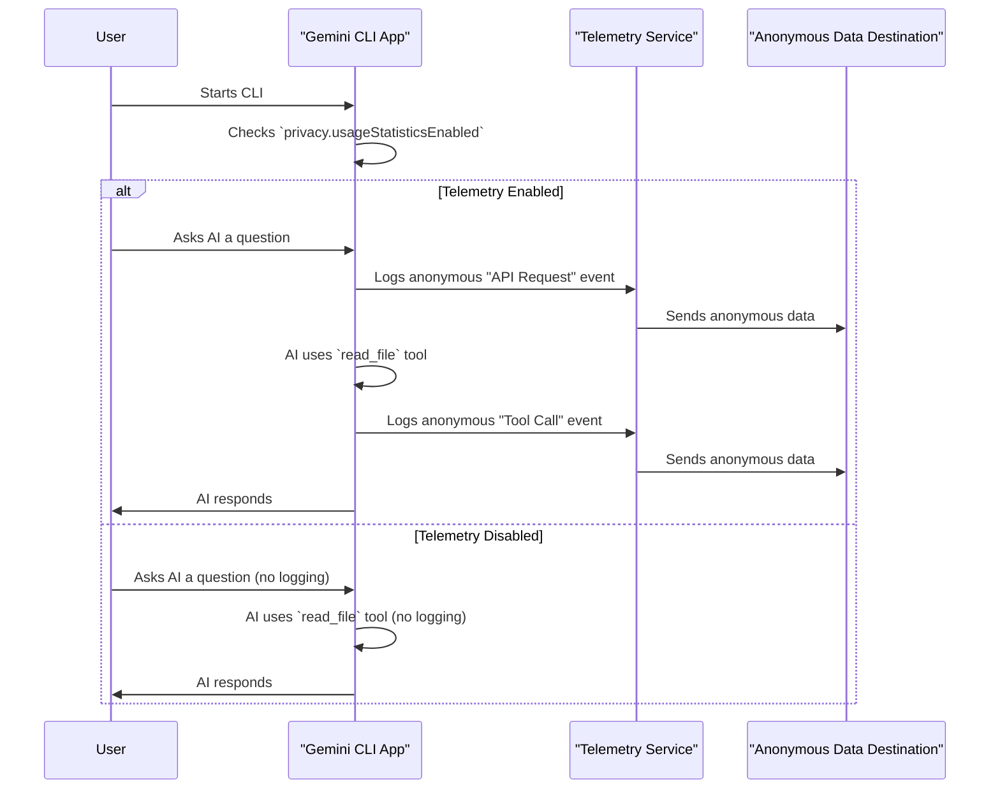

# Chapter 8: Usage Telemetry

In [Chapter 7: AI Agent Loop](07_ai_agent_loop_.md), you saw how the Gemini AI can act like a smart agent, using tools and thinking through multiple steps to solve complex problems. This makes Gemini CLI a super powerful assistant!

Now, let's talk about how the developers of Gemini CLI make the application even better for *everyone*. Imagine you're building a new tool. How do you know if people like a certain feature, or if a part of the tool is causing problems? You need feedback! But, because Gemini CLI handles your private code and thoughts, getting feedback has to be done very carefully.

This is where **Usage Telemetry** comes in. It's like a special, privacy-aware feedback mechanism. It helps the developers understand which features are popular, identify common issues, and improve the application over time, all *without* collecting any personal or sensitive data from you. It's a way for you to contribute to making Gemini CLI better just by using it, while keeping your privacy safe.

### Why Do We Need Usage Telemetry?

Think of Gemini CLI as a new car. The engineers want to make sure it's comfortable, reliable, and has all the features drivers need.
*   If they see many drivers frequently use the "lane assist" feature, they know it's popular and might invest more in it.
*   If a specific engine part often sends error signals (without revealing *who* is driving, or *where* they're going), they know that part needs improvement.

Usage telemetry for Gemini CLI works similarly. It helps developers answer questions like:
*   Are people using the `read_file` tool often?
*   How long does it usually take for the AI to respond?
*   Are there common errors that happen across many users (without knowing whose specific errors)?

By understanding these general patterns, developers can prioritize what to fix, what to build next, and how to improve the overall stability and performance of the application for the entire community.

### Key Concepts of Usage Telemetry

The core idea is to collect useful, anonymous data while strongly protecting your privacy.

1.  **Anonymous Information:**
    *   Telemetry only collects data about *how* the application is used, not *who* is using it or *what specific tasks* they are doing.
    *   It's like counting how many times a certain button is clicked, without knowing which person clicked it or what they were trying to achieve with that click.

2.  **What's Collected (Examples):**
    *   **Tool Usage:** We log the names of the *built-in tools* that are called (e.g., `read_file`, `run_shell_command`), whether they succeeded or failed, and how long they took. We *do not* log the arguments you passed to the tools (like file names or command strings) or any data returned by them.
    *   **AI API Requests:** We log which Gemini model was used (e.g., `gemini-1.5-pro`), the duration of the request, and if it was successful. We *do not* log the content of your prompts or the AI's responses.
    *   **Session Information:** General information about the CLI's configuration, such as which optional components are enabled.

3.  **What's *NOT* Collected (Your Privacy is Paramount):**
    *   **No Personally Identifiable Information (PII):** Your name, email address, API keys, or any other personal details are *never* collected.
    *   **No Prompt/Response Content:** The actual questions you ask the AI and the answers it gives you are *never* logged. Your conversations remain completely private.
    *   **No File Content:** The content of any files you ask the AI to read or write is *never* logged.

### Use Case: Managing Your Privacy (Opting In or Out)

Usage telemetry is enabled by default because it's so helpful for improving the CLI. However, you are always in control and can opt out at any time.

You manage this setting in your **User Settings File** (your global `settings.json`):

1.  **Locate Your User Settings File:**
    Open your `settings.json` file, usually located at `~/.gemini/settings.json`.

    ```bash
    code ~/.gemini/settings.json
    ```
    (Or use your preferred text editor.)

2.  **Check or Change the Setting:**
    Look for the `privacy` section and the `usageStatisticsEnabled` property.

    *   **To Opt Out (Disable Telemetry):**
        Set `usageStatisticsEnabled` to `false`:
        ```json
        // ~/.gemini/settings.json
        {
          "privacy": {
            "usageStatisticsEnabled": false
          }
        }
        ```
        **What happens:** Gemini CLI will stop collecting and sharing anonymous usage statistics.

    *   **To Opt In (Enable Telemetry):**
        If you previously opted out and want to re-enable, set `usageStatisticsEnabled` to `true`:
        ```json
        // ~/.gemini/settings.json
        {
          "privacy": {
            "usageStatisticsEnabled": true
          }
        }
        ```
        **What happens:** Gemini CLI will resume collecting and sharing anonymous usage statistics.

    Save the file after making any changes. The setting will take effect the next time you launch Gemini CLI.

### Under the Hood: How Telemetry Works (Simplified)

When telemetry is enabled, Gemini CLI acts like a quiet observer, looking for certain "events" that happen during your interaction. When an event occurs (like an AI request finishing or a tool being used), a small, anonymous record of that event is created and sent out.

#### Step-by-Step Walkthrough

1.  **CLI Starts:** When you launch Gemini CLI, it first checks your [Chapter 3: Configuration](03_configuration_.md) (specifically, your `settings.json` files) to see if `privacy.usageStatisticsEnabled` is set to `true`.
2.  **An Event Happens:** You interact with the CLI. For example, you ask the AI a question, or the AI uses a tool like `read_file`.
3.  **Anonymous Event Record Created:** If telemetry is enabled, a special "event record" is created. This record contains *only* anonymous data relevant to the event (e.g., "tool `read_file` was called," "it succeeded," "it took 50 milliseconds"). It *never* includes the file name, the command arguments, or your prompt content.
4.  **Event Sent to Telemetry Service:** This anonymous event record is then passed to an internal "Telemetry Service" within Gemini CLI.
5.  **Telemetry Service Sends Data:** The Telemetry Service sends this anonymous event data to a designated destination. This could be a local file on your computer (for local debugging by developers) or a Google Cloud service for aggregate analysis by the development team.
6.  **Data for Improvement:** The aggregated, anonymous data from many users helps the developers understand trends and make informed decisions on how to improve Gemini CLI for future versions.

Here's a simplified diagram of this process:



#### Inside the Code (Simplified)

The core `Config` object, which you learned about in [Chapter 3: Configuration](03_configuration_.md), holds the final, merged settings, including those for privacy and telemetry.

The actual logging of events happens through functions within the `packages/core/src/telemetry` directory.

1.  **Configuration Check:**
    The `Config` object internally holds the resolved telemetry settings, combining defaults, `settings.json` values, and environment variables.

    ```typescript
    // In packages/core/src/config/config.ts (Simplified)
    import { resolveTelemetrySettings, type TelemetrySettings } from '../telemetry/index.js';

    export class Config {
      // ... other properties
      private telemetrySettings: TelemetrySettings;

      constructor(params: ConfigParameters) {
        // ...
        // Resolve telemetry settings from various sources
        this.telemetrySettings = resolveTelemetrySettings(
          params.telemetry, // From settings.json or CLI args
          process.env,      // From environment variables
          // ... and application defaults
        );
        // ...
      }

      getTelemetrySettings(): TelemetrySettings {
        return this.telemetrySettings; // Provides access to the resolved settings
      }
      // ...
    }
    ```
    This shows how the `Config` object gets the final `TelemetrySettings`, which includes the `enabled` status based on your `privacy.usageStatisticsEnabled` and other settings.

2.  **Logging an Event (Example: Tool Call):**
    When a tool is called, if telemetry is enabled, a specific logging function is invoked. Notice how it focuses on the tool's *name* and *outcome*, not the specifics of its use.

    ```typescript
    // In packages/core/src/telemetry/loggers.ts (Simplified)
    import { isTelemetrySdkInitialized, getTelemetrySettings } from './sdk.js';
    import { recordToolCallMetrics } from './metrics.js';
    import { recordEvent } from './event-recorder.js'; // A general event recording utility

    export function logToolCall(
      function_name: string,
      success: boolean,
      duration_ms: number,
      // ... other anonymous metrics like decision, model, etc.
    ): void {
      const telemetrySettings = getTelemetrySettings();
      // Only log if telemetry is enabled overall AND usage statistics are enabled
      if (!telemetrySettings.enabled || !telemetrySettings.usageStatisticsEnabled) {
        return; // Do nothing if telemetry is off
      }

      recordEvent('tool.call', { // Record a generic "tool.call" event
        function_name,
        success,
        duration_ms,
        // ... other anonymous properties
      });

      // Also record more detailed metrics for analysis
      recordToolCallMetrics(function_name, success, duration_ms);
    }
    ```
    This `logToolCall` function demonstrates how a specific event (a tool call) is logged. It first checks if telemetry is enabled (via `telemetrySettings.enabled` and `telemetrySettings.usageStatisticsEnabled`). If it is, it records an anonymous event with details like the `function_name` (e.g., "read_file"), `success` status, and `duration_ms`, without capturing any sensitive data.

### Conclusion

You've now learned about **Usage Telemetry** in Gemini CLI! You understand it's a vital, privacy-aware system that collects anonymous information about how the CLI is used. This data helps developers continually improve the application for everyone, focusing on popular features and fixing common issues. Most importantly, you know that your privacy is protected, with no personal or sensitive data ever being collected, and you always have the power to opt out through your `settings.json` file.

---

<sub><sup>Generated by [AI Codebase Knowledge Builder](https://github.com/The-Pocket/Tutorial-Codebase-Knowledge).</sup></sub> <sub><sup>**References**: [[1]](https://github.com/google-gemini/gemini-cli/blob/d37fff7fd60fd1e9b69f487d5f23b1121792d331/docs/cli/configuration.md), [[2]](https://github.com/google-gemini/gemini-cli/blob/d37fff7fd60fd1e9b69f487d5f23b1121792d331/packages/core/src/telemetry/index.ts), [[3]](https://github.com/google-gemini/gemini-cli/blob/d37fff7fd60fd1e9b69f487d5f23b1121792d331/packages/core/src/telemetry/uiTelemetry.ts)</sup></sub>