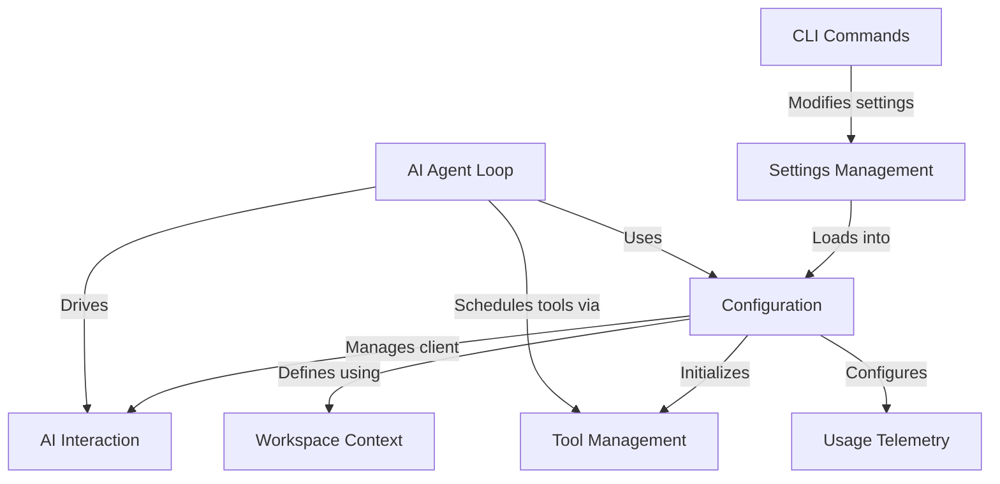

# Tutorial: gemini-cli

The Gemini CLI is a **powerful command-line tool** that lets you *directly interact with the Google Gemini AI*. It uses a sophisticated **configuration system** to tailor AI responses and manage *various helper tools* for tasks like file operations or web searches. The CLI orchestrates *intelligent conversations* and **multi-step reasoning**, all while providing a *flexible command interface* and collecting anonymous usage data to continuously improve your experience.

## Visual Overview

## Chapters

1. [CLI Commands
](01_cli_commands_.md)
2. [Settings Management
](02_settings_management_.md)
3. [Configuration
](03_configuration_.md)
4. [Workspace Context
](04_workspace_context_.md)
5. [AI Interaction
](05_ai_interaction_.md)
6. [Tool Management
](06_tool_management_.md)
7. [AI Agent Loop
](07_ai_agent_loop_.md)
8. [Usage Telemetry
](08_usage_telemetry_.md)

---

Generated by [AI Codebase Knowledge Builder](https://github.com/The-Pocket/Tutorial-Codebase-Knowledge).